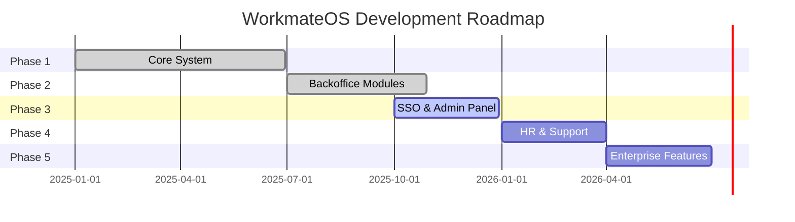
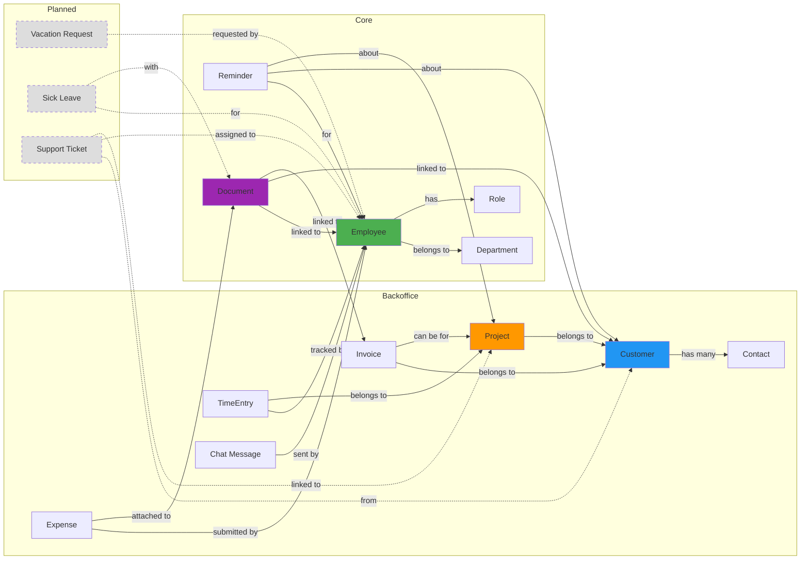
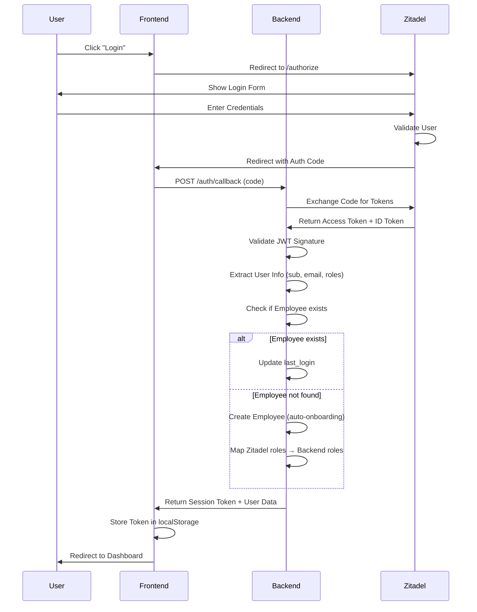
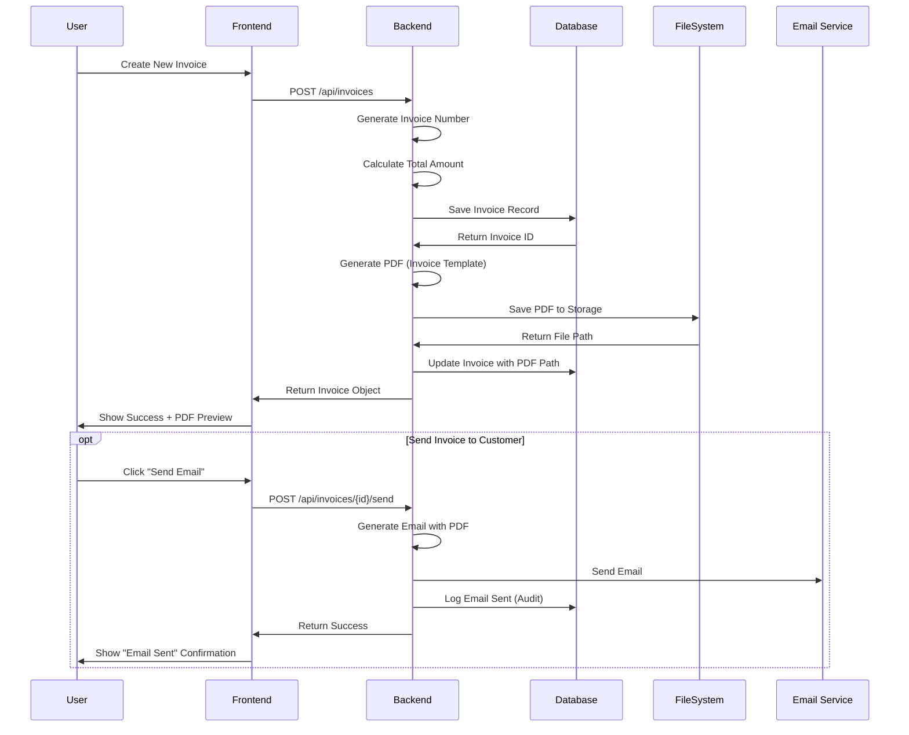
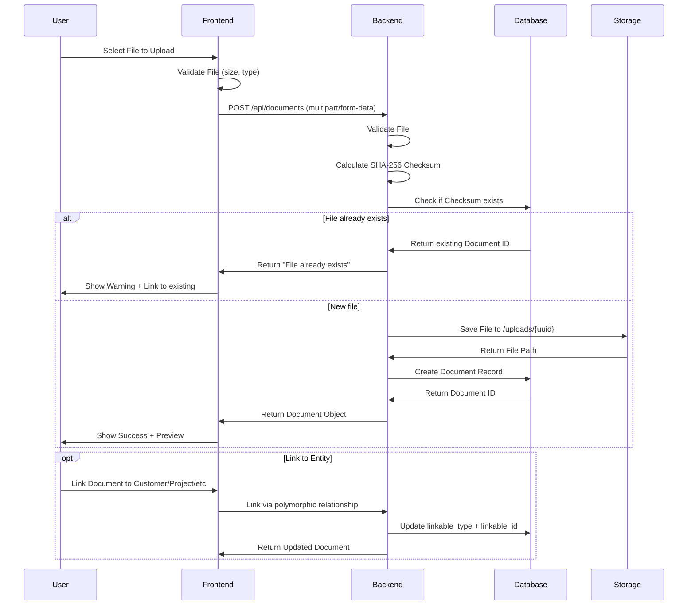
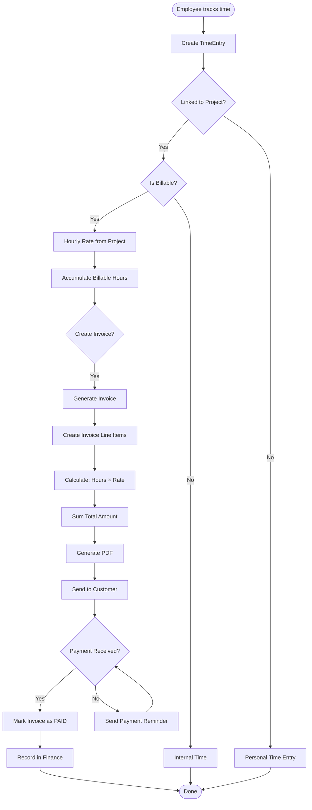
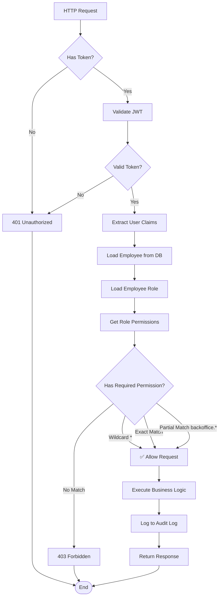
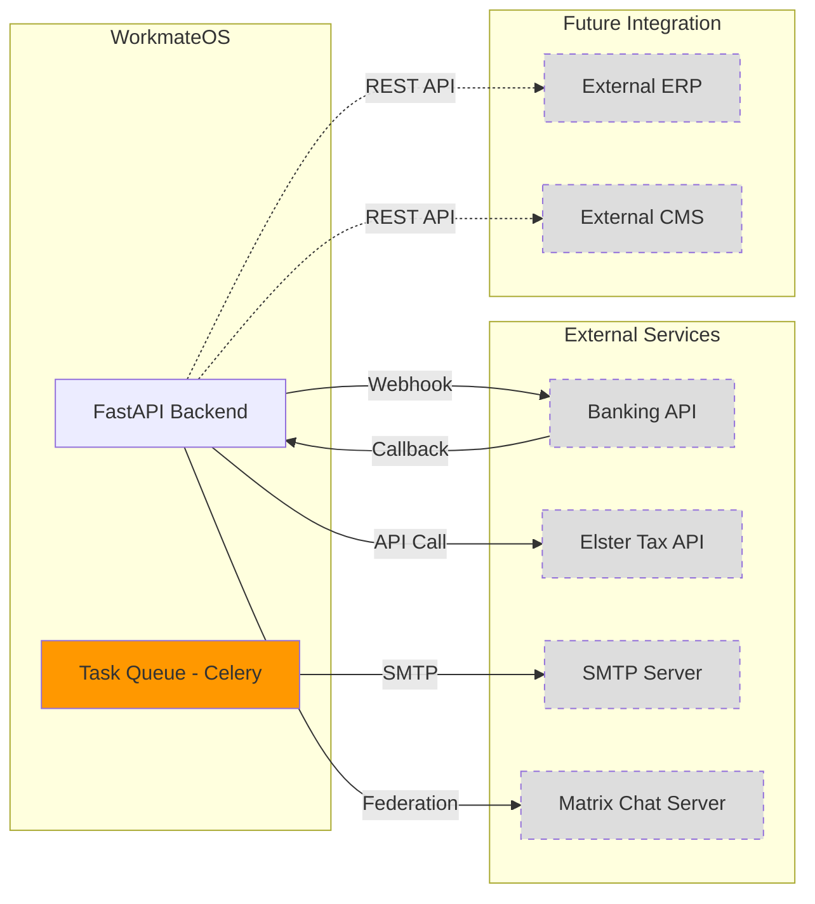
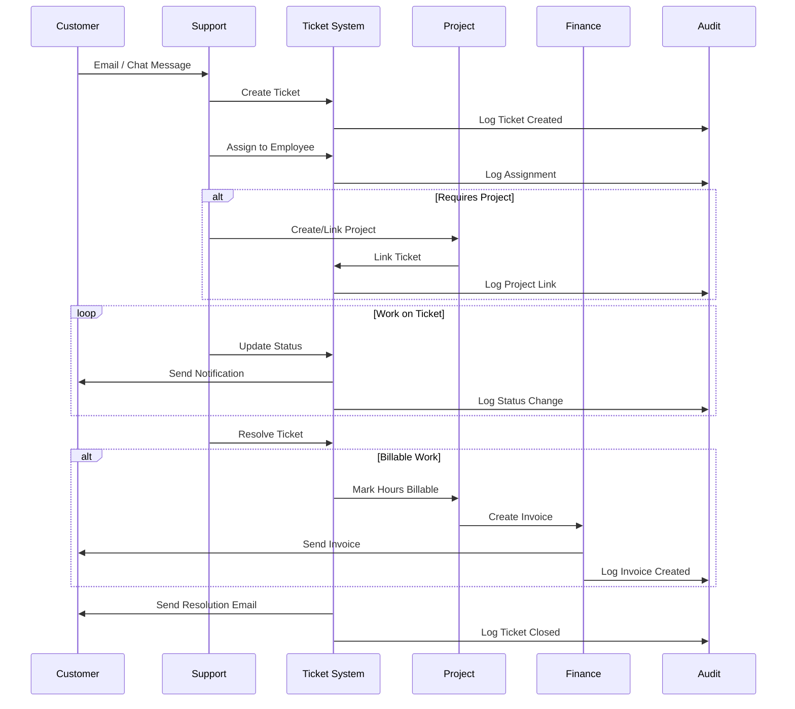

# 🏗️ WorkmateOS - System-Architektur

**Digitaler Workbuddy für moderne Unternehmen**

**Version:** 2.0
**Status:** Phase 3 (80% Complete)
**Letzte Aktualisierung:** 30. Dezember 2025

---

## 📋 Inhaltsverzeichnis

1. [Vision & Konzept](#vision--konzept)
2. [High-Level Architektur](#high-level-architektur)
3. [Modul-Übersicht](#modul-übersicht)
4. [Tech Stack](#tech-stack)
5. [Datenfluss-Diagramme](#datenfluss-diagramme)
6. [Deployment-Architektur](#deployment-architektur)
7. [Sicherheitsarchitektur](#sicherheitsarchitektur)
8. [Kommunikations-Patterns](#kommunikations-patterns)

---

## Vision & Konzept

**WorkmateOS** ist ein digitaler Workbuddy - eine All-in-One Plattform für Unternehmens-Management mit:

- 🎯 **Modularer Architektur** - Jedes Modul eigenständig, aber eng verzahnt
- 🔄 **Zentrale Kommunikation** - Ticketsystem + Chat für interne/externe Kommunikation
- 📊 **Vollständiges Logging** - Alle Kundenkommunikation wird dokumentiert
- 🔐 **SSO & RBAC** - Zentrales Identity Management mit Zitadel
- 🚀 **Cloud-Ready** - Docker-basiert, horizontal skalierbar

---

## High-Level Architektur

### System-Komponenten Übersicht

```mermaid
graph TB
    subgraph "Frontend Layer"
        UI[Vue 3 SPA]
        Mobile[Mobile App - geplant]
    end

    subgraph "API Gateway"
        API[FastAPI Backend]
        Auth[Zitadel SSO]
    end

    subgraph "Core Modules"
        Employees[Employees]
        Documents[Documents]
        Reminders[Reminders]
        Dashboards[Dashboards]
    end

    subgraph "Backoffice Modules"
        CRM[CRM]
        Projects[Projects]
        Invoices[Invoices]
        Finance[Finance/Expenses]
        TimeTrack[Time Tracking]
        Chat[Chat]
    end

    subgraph "Planned Modules"
        HR[HR - Urlaub/Krank]
        Support[Support/Tickets]
        Wiki[Knowledge Base]
    end

    subgraph "Data Layer"
        DB[(PostgreSQL)]
        Cache[(Redis - geplant)]
        Storage[File Storage]
    end

    subgraph "External Services"
        Bank[Banking API]
        Elster[Elster Steuer]
        Email[E-Mail Service]
    end

    UI --> API
    Mobile -.-> API
    API --> Auth

    API --> Employees
    API --> Documents
    API --> Reminders
    API --> Dashboards

    API --> CRM
    API --> Projects
    API --> Invoices
    API --> Finance
    API --> TimeTrack
    API --> Chat

    API -.-> HR
    API -.-> Support
    API -.-> Wiki

    Employees --> DB
    Documents --> DB
    Documents --> Storage
    CRM --> DB
    Projects --> DB
    Invoices --> DB
    Finance --> DB
    TimeTrack --> DB
    Chat --> DB

    Finance -.-> Bank
    Finance -.-> Elster
    Reminders -.-> Email

    style UI fill:#4CAF50
    style API fill:#2196F3
    style Auth fill:#FF9800
    style DB fill:#9C27B0
    style HR fill:#ddd,stroke-dasharray: 5 5
    style Support fill:#ddd,stroke-dasharray: 5 5
    style Wiki fill:#ddd,stroke-dasharray: 5 5
```



### ASCII-Art Architektur (Terminal-freundlich)

```
┌──────────────────────────────────────────────────────────────────────┐
│                          WorkmateOS Platform                         │
├──────────────────────────────────────────────────────────────────────┤
│                                                                      │
│  ┌──────────────┐                           ┌──────────────┐        │
│  │              │                           │              │        │
│  │   Vue 3 UI   │◄──────── HTTPS ─────────►│   Zitadel    │        │
│  │   Frontend   │                           │     SSO      │        │
│  │              │                           │              │        │
│  └──────┬───────┘                           └──────────────┘        │
│         │                                                            │
│         │ REST API (JSON)                                            │
│         ▼                                                            │
│  ┌──────────────────────────────────────────────────────────────┐   │
│  │                    FastAPI Backend                           │   │
│  ├──────────────────────────────────────────────────────────────┤   │
│  │                                                              │   │
│  │  ┌────────────┐  ┌────────────┐  ┌────────────┐             │   │
│  │  │   Core     │  │ Backoffice │  │  Planned   │             │   │
│  │  ├────────────┤  ├────────────┤  ├────────────┤             │   │
│  │  │ Employees  │  │    CRM     │  │     HR     │ (Phase 4)   │   │
│  │  │ Documents  │  │  Projects  │  │  Support   │             │   │
│  │  │ Reminders  │  │  Invoices  │  │    Wiki    │             │   │
│  │  │ Dashboards │  │  Finance   │  └────────────┘             │   │
│  │  │   System   │  │ Time Track │                             │   │
│  │  │            │  │    Chat    │                             │   │
│  │  └────────────┘  └────────────┘                             │   │
│  │                                                              │   │
│  └──────────────────────┬───────────────────────────────────────┘   │
│                         │                                            │
│                         ▼                                            │
│  ┌──────────────────────────────────────────────────────────────┐   │
│  │                    Data & Storage                            │   │
│  ├──────────────────────────────────────────────────────────────┤   │
│  │  ┌──────────────┐  ┌──────────────┐  ┌──────────────┐       │   │
│  │  │  PostgreSQL  │  │ File Storage │  │    Redis     │       │   │
│  │  │   Database   │  │   (S3/FS)    │  │   (Cache)    │       │   │
│  │  │              │  │              │  │   [geplant]  │       │   │
│  │  └──────────────┘  └──────────────┘  └──────────────┘       │   │
│  └──────────────────────────────────────────────────────────────┘   │
│                                                                      │
│  ┌──────────────────────────────────────────────────────────────┐   │
│  │              External Service Integrations                   │   │
│  ├──────────────────────────────────────────────────────────────┤   │
│  │  • Banking API (Kontoauszüge)           [geplant]           │   │
│  │  • Elster (Steuerverwaltung)            [geplant]           │   │
│  │  • E-Mail Service (Benachrichtigungen)  [geplant]           │   │
│  │  • Matrix Chat Integration              [geplant]           │   │
│  └──────────────────────────────────────────────────────────────┘   │
│                                                                      │
└──────────────────────────────────────────────────────────────────────┘
```

---

## Modul-Übersicht

### Phase-basierte Implementierung



### Module & Status

#### ✅ Core-Module (Phase 1 - Complete)

```
┌─────────────────────────────────────────────────────────────┐
│                      CORE MODULES                           │
├─────────────────────────────────────────────────────────────┤
│                                                             │
│  👥 Employees         Mitarbeiter, Abteilungen, Rollen     │
│  📄 Documents         Dokumente Upload/Download/Verwaltung  │
│  🔔 Reminders         Erinnerungen & Benachrichtigungen     │
│  📊 Dashboards        User-Dashboards (personalisierbar)    │
│  ⚙️  System           Health, Info, Infrastructure          │
│                                                             │
└─────────────────────────────────────────────────────────────┘
```

**Technische Details:**
- **Employees:** CRUD für Employees, Departments, Roles + SSO-Integration
- **Documents:** File Upload mit Checksum-Validierung, verknüpfbar mit allen Entities
- **Reminders:** Polymorphe Verknüpfung (Employee, Customer, Project, etc.)
- **Dashboards:** User-spezifische Dashboard-Konfiguration (JSON)
- **System:** Health-Check, Version-Info

#### ✅ Backoffice-Module (Phase 2 - Complete)

```
┌─────────────────────────────────────────────────────────────┐
│                   BACKOFFICE MODULES                        │
├─────────────────────────────────────────────────────────────┤
│                                                             │
│  🤝 CRM               Kunden, Kontakte, Aktivitäten         │
│  📋 Projects          Projekt-Management mit Budget         │
│  💰 Invoices          Rechnungserstellung & Zahlungen       │
│  💳 Finance           Ausgaben-Management & Belege          │
│  ⏱️  Time Tracking    Zeiterfassung (billable/non-billable)│
│  💬 Chat              Messaging-System (in Development)     │
│                                                             │
└─────────────────────────────────────────────────────────────┘
```

**Technische Details:**
- **CRM:** Customer + Contact Management mit Activity Tracking
- **Projects:** Budget Tracking, Zeit-Erfassung-Verknüpfung
- **Invoices:** PDF-Generierung, Payment Tracking, Status-Management
- **Finance:** Expense Management mit Receipt-Upload
- **Time Tracking:** Billable Hours, Projekt-Zuordnung
- **Chat:** Real-time Messaging (WebSocket/SSE geplant)

#### ⏳ Phase 3: SSO & Admin (80% Complete)

```
┌─────────────────────────────────────────────────────────────┐
│                 SSO & ADMIN FEATURES                        │
├─────────────────────────────────────────────────────────────┤
│                                                             │
│  ✅ Zitadel SSO                OAuth2/OIDC Integration      │
│  ✅ Role Mapping               Zitadel → Backend Roles      │
│  ✅ Wildcard Permissions       Flexible Permission System   │
│  ✅ Admin Panel (5 Pages)      User/Dept/Role Management    │
│  ⏳ Audit Log Backend          System Events Tracking       │
│  ⏳ System Settings Backend    Global Configuration         │
│                                                             │
└─────────────────────────────────────────────────────────────┘
```

#### 📅 Phase 4: HR & Support (Planned)

```
┌─────────────────────────────────────────────────────────────┐
│                    PLANNED MODULES                          │
├─────────────────────────────────────────────────────────────┤
│                                                             │
│  🏥 HR Module                                               │
│     • Urlaubsverwaltung (mit Kalender)                      │
│     • Krankmeldungen (Dokument-Verknüpfung)                │
│     • Bewerbungsmanagement                                  │
│     • Teamkalender / Ressourcenplanung                      │
│                                                             │
│  🎫 Support/Ticketing                                       │
│     • Kundentickets bearbeiten                              │
│     • Ticket → Projekt Verknüpfung                          │
│     • Vollständiges Logging aller Interaktionen             │
│     • Integration mit Chat-System                           │
│                                                             │
│  📚 Knowledge Base / Wiki                                   │
│     • Interne Dokumentation                                 │
│     • FAQ-System                                            │
│     • Verknüpfung mit Support-Tickets                       │
│                                                             │
└─────────────────────────────────────────────────────────────┘
```

#### 📅 Phase 5: Enterprise Features (Planned)

```
┌─────────────────────────────────────────────────────────────┐
│                 ENTERPRISE FEATURES                         │
├─────────────────────────────────────────────────────────────┤
│                                                             │
│  🏦 Banking Integration       • Kontoauszüge automatisch    │
│                               • Zahlungsstatus-Sync          │
│                                                             │
│  💼 Elster Integration        • Steuerverwaltung           │
│                               • Automatische Meldungen      │
│                                                             │
│  📱 Mobile App                • React Native / Flutter     │
│                               • Offline-Modus              │
│                                                             │
│  🔄 Advanced Features         • Multi-Tenancy              │
│                               • API Versioning             │
│                               • Webhooks                   │
│                               • Rate Limiting              │
│                               • Advanced Reporting         │
│                                                             │
└─────────────────────────────────────────────────────────────┘
```

---

## Modul-Beziehungen

### Entity-Relationship-Übersicht



### Modul-Abhängigkeiten

```
                    ┌──────────────┐
                    │   Employees  │
                    │  (Core Auth) │
                    └───────┬──────┘
                            │
            ┌───────────────┼───────────────┐
            │               │               │
            ▼               ▼               ▼
    ┌───────────┐   ┌───────────┐   ┌───────────┐
    │    CRM    │   │ Projects  │   │   HR      │
    │           │   │           │   │ (planned) │
    └─────┬─────┘   └─────┬─────┘   └───────────┘
          │               │
          │       ┌───────┴───────┐
          │       │               │
          ▼       ▼               ▼
    ┌─────────────────┐   ┌──────────────┐
    │    Invoices     │   │ Time Tracking│
    │                 │   │              │
    └────────┬────────┘   └──────┬───────┘
             │                   │
             └────────┬──────────┘
                      │
                      ▼
              ┌──────────────┐
              │   Finance    │
              │  (Expenses)  │
              └──────────────┘

             Documents & Reminders
            können an ALLES gehängt werden
                  (Polymorphic)
```

**Abhängigkeits-Matrix:**

| Modul | Abhängig von | Genutzt von |
|-------|--------------|-------------|
| **Employees** | - | Alle Module (Authentication) |
| **CRM** | Employees | Invoices, Projects, Support |
| **Projects** | Employees, CRM | Time Tracking, Invoices |
| **Invoices** | CRM, Projects | Finance |
| **Time Tracking** | Employees, Projects | Invoices (Billing) |
| **Finance** | Employees, Invoices | - |
| **Documents** | - | Alle Module (Polymorphic) |
| **Reminders** | - | Alle Module (Polymorphic) |
| **Chat** | Employees | Support (geplant) |

---

## Tech Stack

### Frontend

```
┌──────────────────────────────────────────────┐
│              Frontend Stack                  │
├──────────────────────────────────────────────┤
│                                              │
│  Framework:        Vue 3 (Composition API)   │
│  Language:         TypeScript                │
│  Build Tool:       Vite                      │
│  State:            Pinia                     │
│  Router:           Vue Router 4              │
│  HTTP Client:      Axios                     │
│  UI Icons:         Lucide Vue Next           │
│  Styling:          Scoped CSS + Variables    │
│  Auth:             OAuth2/OIDC (Zitadel)     │
│                                              │
└──────────────────────────────────────────────┘
```

### Backend

```
┌──────────────────────────────────────────────┐
│              Backend Stack                   │
├──────────────────────────────────────────────┤
│                                              │
│  Framework:        FastAPI                   │
│  Language:         Python 3.13               │
│  ORM:              SQLAlchemy 2.0            │
│  Validation:       Pydantic v2               │
│  Database:         PostgreSQL 16             │
│  Migrations:       Alembic                   │
│  Auth:             Zitadel (OAuth2/OIDC)     │
│  API Docs:         Swagger/OpenAPI           │
│  Testing:          Pytest                    │
│                                              │
└──────────────────────────────────────────────┘
```

### Infrastructure

```
┌──────────────────────────────────────────────┐
│           Infrastructure Stack               │
├──────────────────────────────────────────────┤
│                                              │
│  Containerization:  Docker + Docker Compose  │
│  Database:          PostgreSQL 16            │
│  Cache:             Redis (geplant)          │
│  File Storage:      Local FS / S3 (geplant) │
│  CI/CD:             GitHub Actions           │
│  Reverse Proxy:     Nginx (Production)       │
│  SSL/TLS:           Let's Encrypt            │
│  Monitoring:        Prometheus (geplant)     │
│  Logging:           Grafana (geplant)        │
│  Error Tracking:    Sentry (geplant)         │
│                                              │
└──────────────────────────────────────────────┘
```

---

## Datenfluss-Diagramme

### User-Login Flow (SSO)



### Invoice Creation Flow



### Document Upload Flow



### Time Tracking → Invoice Flow



---

## Deployment-Architektur

### Development Environment

```
┌────────────────────────────────────────────────────────────┐
│                 Development Setup                          │
├────────────────────────────────────────────────────────────┤
│                                                            │
│  Developer Machine (localhost)                             │
│  ┌──────────────────────────────────────────────────────┐ │
│  │                                                      │ │
│  │  Frontend:    http://localhost:5173    (Vite Dev)   │ │
│  │  Backend:     http://localhost:8000    (Uvicorn)    │ │
│  │  Database:    localhost:5432           (PostgreSQL) │ │
│  │  Zitadel:     https://zitadel.example.com (Cloud)   │ │
│  │                                                      │ │
│  └──────────────────────────────────────────────────────┘ │
│                                                            │
│  Hot-Reload: ✅   Auto-Restart: ✅   Debug Mode: ✅        │
│                                                            │
└────────────────────────────────────────────────────────────┘
```

### Production Environment

```
┌─────────────────────────────────────────────────────────────────────┐
│                      Production Deployment                          │
├─────────────────────────────────────────────────────────────────────┤
│                                                                     │
│  Cloud Provider (DigitalOcean / AWS / Hetzner)                      │
│                                                                     │
│  ┌───────────────────────────────────────────────────────────────┐ │
│  │  Nginx Reverse Proxy (SSL Termination)                       │ │
│  │  • Port 443 (HTTPS)                                           │ │
│  │  • Let's Encrypt SSL Certificate                              │ │
│  │  • Rate Limiting                                              │ │
│  └─────────────┬─────────────────────────┬───────────────────────┘ │
│                │                         │                         │
│                ▼                         ▼                         │
│  ┌──────────────────────┐  ┌──────────────────────┐               │
│  │  Frontend Container  │  │  Backend Container   │               │
│  │  • Vue 3 SPA         │  │  • FastAPI App       │               │
│  │  • Nginx (Static)    │  │  • Gunicorn Workers  │               │
│  │  • Port 80           │  │  • Port 8000         │               │
│  └──────────────────────┘  └──────────┬───────────┘               │
│                                       │                            │
│                                       ▼                            │
│                         ┌──────────────────────────┐               │
│                         │  PostgreSQL Container    │               │
│                         │  • PostgreSQL 16         │               │
│                         │  • Persistent Volume     │               │
│                         │  • Port 5432             │               │
│                         └──────────────────────────┘               │
│                                                                     │
│  ┌───────────────────────────────────────────────────────────────┐ │
│  │  External Services                                            │ │
│  │  • Zitadel (Identity Provider)                                │ │
│  │  • S3 / Object Storage (geplant)                              │ │
│  │  • Email Service (geplant)                                    │ │
│  └───────────────────────────────────────────────────────────────┘ │
│                                                                     │
└─────────────────────────────────────────────────────────────────────┘
```

### Docker Compose Structure

```yaml
# Simplified docker-compose.yml Structure

services:
  # Frontend
  frontend:
    image: workmateos-frontend:latest
    ports:
      - "80:80"
    environment:
      - VITE_API_URL=https://api.workmate.example.com
      - VITE_ZITADEL_ISSUER=https://zitadel.example.com
    depends_on:
      - backend

  # Backend
  backend:
    image: workmateos-backend:latest
    ports:
      - "8000:8000"
    environment:
      - DATABASE_URL=postgresql://user:pass@db:5432/workmate
      - ZITADEL_ISSUER=https://zitadel.example.com
    depends_on:
      - db
    volumes:
      - ./uploads:/app/uploads  # Persistent file storage

  # Database
  db:
    image: postgres:16
    ports:
      - "5432:5432"
    environment:
      - POSTGRES_USER=workmate
      - POSTGRES_PASSWORD=secure_password
      - POSTGRES_DB=workmate
    volumes:
      - pgdata:/var/lib/postgresql/data  # Persistent DB

  # Nginx (Reverse Proxy)
  nginx:
    image: nginx:alpine
    ports:
      - "443:443"
    volumes:
      - ./nginx.conf:/etc/nginx/nginx.conf
      - ./ssl:/etc/nginx/ssl  # SSL Certificates
    depends_on:
      - frontend
      - backend

volumes:
  pgdata:  # Persistent PostgreSQL data
```

---

## Sicherheitsarchitektur

### Security Layers

```
┌─────────────────────────────────────────────────────────┐
│                   Security Layers                       │
├─────────────────────────────────────────────────────────┤
│                                                         │
│  Layer 1: Network Security                              │
│  ┌───────────────────────────────────────────────────┐ │
│  │  • HTTPS only (TLS 1.3)                           │ │
│  │  • Firewall Rules (UFW/iptables)                  │ │
│  │  • Rate Limiting (Nginx)                          │ │
│  │  • DDoS Protection (Cloudflare - optional)        │ │
│  └───────────────────────────────────────────────────┘ │
│                                                         │
│  Layer 2: Authentication & Authorization                │
│  ┌───────────────────────────────────────────────────┐ │
│  │  • OAuth2/OIDC (Zitadel)                          │ │
│  │  • JWT Token Validation                           │ │
│  │  • Role-Based Access Control (RBAC)               │ │
│  │  • Wildcard Permissions (*, backoffice.*)         │ │
│  │  • Token Expiration (15min Access, 7d Refresh)    │ │
│  └───────────────────────────────────────────────────┘ │
│                                                         │
│  Layer 3: Application Security                          │
│  ┌───────────────────────────────────────────────────┐ │
│  │  • Input Validation (Pydantic)                    │ │
│  │  • SQL Injection Prevention (SQLAlchemy ORM)      │ │
│  │  • XSS Prevention (Vue 3 auto-escaping)           │ │
│  │  • CORS Configuration (Strict Origin)             │ │
│  │  • CSRF Protection (SameSite Cookies)             │ │
│  └───────────────────────────────────────────────────┘ │
│                                                         │
│  Layer 4: Data Security                                 │
│  ┌───────────────────────────────────────────────────┐ │
│  │  • Password Hashing (bcrypt/argon2)               │ │
│  │  • Database Encryption at Rest (optional)         │ │
│  │  • File Checksum Validation (SHA-256)             │ │
│  │  • Audit Logging (All User Actions)               │ │
│  │  • Backup Encryption (Production)                 │ │
│  └───────────────────────────────────────────────────┘ │
│                                                         │
└─────────────────────────────────────────────────────────┘
```

### Permission Flow



---

## Kommunikations-Patterns

### Internal Module Communication

```
┌─────────────────────────────────────────────────────────┐
│          Module Communication Patterns                  │
├─────────────────────────────────────────────────────────┤
│                                                         │
│  Pattern 1: Direct Database Foreign Keys                │
│  ┌───────────────────────────────────────────────────┐ │
│  │  Invoice.customer_id → Customer.id                │ │
│  │  TimeEntry.employee_id → Employee.id              │ │
│  │  Project.customer_id → Customer.id                │ │
│  └───────────────────────────────────────────────────┘ │
│                                                         │
│  Pattern 2: Polymorphic Relationships                   │
│  ┌───────────────────────────────────────────────────┐ │
│  │  Document.linkable_type = "customer"              │ │
│  │  Document.linkable_id = customer.id               │ │
│  │                                                   │ │
│  │  Reminder.remindable_type = "project"             │ │
│  │  Reminder.remindable_id = project.id              │ │
│  └───────────────────────────────────────────────────┘ │
│                                                         │
│  Pattern 3: Service Layer Communication (Future)        │
│  ┌───────────────────────────────────────────────────┐ │
│  │  InvoiceService.create_from_time_entries()        │ │
│  │    → TimeTrackingService.get_billable_hours()    │ │
│  │    → ProjectService.get_hourly_rate()             │ │
│  │    → PDFService.generate_invoice()                │ │
│  └───────────────────────────────────────────────────┘ │
│                                                         │
└─────────────────────────────────────────────────────────┘
```

### External Communication (Planned)



### Ticket System Flow (Planned)



**Vollständiges Logging:**
- Jede Kundenkommunikation wird geloggt
- Ticket → Projekt Verknüpfung tracked
- Status-Änderungen mit Timestamp
- Zugewiesener Mitarbeiter recorded
- Billable Hours für Abrechnung

---

## Zukunfts-Vision

### Geplante Erweiterungen

```
┌─────────────────────────────────────────────────────────────┐
│                    Future Roadmap                           │
├─────────────────────────────────────────────────────────────┤
│                                                             │
│  Q1 2026: Phase 4 - HR & Support                            │
│  ✓ Urlaubsverwaltung                                        │
│  ✓ Krankmeldungen                                           │
│  ✓ Support-Ticketsystem                                     │
│  ✓ Knowledge Base / Wiki                                    │
│                                                             │
│  Q2 2026: Phase 5 - Enterprise Features                     │
│  ✓ Multi-Tenancy Support                                    │
│  ✓ Advanced Reporting & Analytics                           │
│  ✓ Mobile App (React Native)                                │
│  ✓ API Versioning                                           │
│  ✓ Webhooks für externe Integration                         │
│                                                             │
│  Q3 2026: Integrations                                      │
│  ✓ Banking API (Kontoauszüge)                               │
│  ✓ Elster (Steuerverwaltung)                                │
│  ✓ Matrix Chat Integration                                  │
│  ✓ E-Mail Service (automatische Benachrichtigungen)         │
│                                                             │
│  Q4 2026: Performance & Scale                               │
│  ✓ Redis Caching Layer                                      │
│  ✓ Database Read Replicas                                   │
│  ✓ CDN für Static Assets                                    │
│  ✓ Microservices Architecture (optional)                    │
│                                                             │
└─────────────────────────────────────────────────────────────┘
```

### Skalierbarkeits-Pfad

```
Phase 1: Monolith (Current)
┌────────────────────────┐
│   Single Server        │
│   • Frontend + Backend │
│   • PostgreSQL         │
│   Max: ~100 Users      │
└────────────────────────┘

Phase 2: Horizontal Scaling
┌────────────────────────────────────────┐
│   Load Balancer                        │
│   ├─ Frontend Instance 1               │
│   ├─ Frontend Instance 2               │
│   ├─ Backend Instance 1                │
│   ├─ Backend Instance 2                │
│   └─ PostgreSQL (Master + Read Replica)│
│   Max: ~1000 Users                     │
└────────────────────────────────────────┘

Phase 3: Microservices (Optional)
┌───────────────────────────────────────────┐
│   API Gateway                             │
│   ├─ Auth Service                         │
│   ├─ Core Service (Employees, etc.)       │
│   ├─ Backoffice Service (CRM, Projects)   │
│   ├─ Finance Service (Invoices, Expenses) │
│   ├─ Chat Service (WebSocket)             │
│   └─ PostgreSQL Cluster + Redis           │
│   Max: 10,000+ Users                      │
└───────────────────────────────────────────┘
```

---

## Performance-Metriken

### Aktueller Stand (Phase 3)

| Metrik | Ziel | Aktuell | Status |
|--------|------|---------|--------|
| **API Response Time** | < 200ms | ~150ms | ✅ |
| **Page Load Time** | < 2s | ~1.5s | ✅ |
| **Database Queries** | < 10 per request | ~8 | ✅ |
| **Concurrent Users** | 100 | 50 (tested) | ✅ |
| **Uptime** | 99.9% | - | ⏳ Produktiv |

### Optimierungs-Potenzial

```
┌─────────────────────────────────────────────────────────┐
│            Performance Optimization                     │
├─────────────────────────────────────────────────────────┤
│                                                         │
│  Backend:                                               │
│  ☑ SQLAlchemy Query Optimization (Eager Loading)       │
│  ☐ Redis Caching für häufige Queries                   │
│  ☐ Database Indexing (wichtige Spalten)                │
│  ☐ Connection Pooling (pgbouncer)                      │
│  ☐ Background Tasks (Celery für Email, PDF, etc.)      │
│                                                         │
│  Frontend:                                              │
│  ☑ Code Splitting (Lazy Loading Routes)                │
│  ☑ Tree Shaking (Vite optimiert)                       │
│  ☐ Image Optimization (WebP, Lazy Loading)             │
│  ☐ Service Worker (Offline Support)                    │
│  ☐ CDN für Static Assets                               │
│                                                         │
│  Database:                                              │
│  ☑ Proper Indexes auf Foreign Keys                     │
│  ☐ Partitioning für große Tabellen                     │
│  ☐ Read Replicas für Reporting                         │
│  ☐ VACUUM & ANALYZE Automatisierung                    │
│                                                         │
└─────────────────────────────────────────────────────────┘
```

---

## Zusammenfassung

**WorkmateOS** ist eine moderne, modulare Unternehmens-Management-Plattform mit:

✅ **Vollständig implementiert:**
- Core System (Employees, Documents, Reminders, Dashboards)
- Backoffice (CRM, Projects, Invoices, Finance, Time Tracking, Chat)
- SSO & Admin Panel (Zitadel OAuth2/OIDC)

⏳ **In Entwicklung:**
- Audit Log Backend
- System Settings Backend
- Chat-System WebSocket

📅 **Geplant:**
- HR-Modul (Urlaub, Krankmeldungen, Bewerbungen)
- Support-Ticketsystem
- Knowledge Base
- Banking & Elster Integration
- Mobile App
- Enterprise Features (Multi-Tenancy, Advanced Reporting)

---

## Siehe auch

- [Backend Module Übersicht](../wiki/backend/MODULE_UEBERSICHT.md)
- [Admin Panel Dokumentation](../wiki/backend/ADMIN_PANEL.md)
- [Authentication & SSO](../wiki/backend/AUTHENTICATION.md)
- [Frontend Architektur](../wiki/frontend/architecture.md)
- [Roadmap & Phasen](../roadmap/README.md)

---

**Letzte Aktualisierung:** 30. Dezember 2025
**Version:** 2.0
**Status:** Phase 3 (80% Complete)
