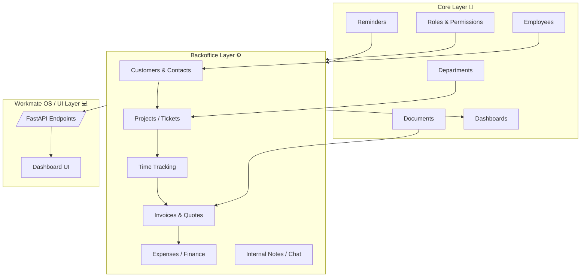
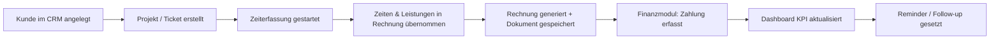

# 🧩 WorkmateOS — Phase 2 (Backoffice & CRM) — **Final Complete Documentation**

**Stand:** 20. November 2025
**Projekt:** WorkmateOS — Phase 2 (Backoffice Layer)
**Ersteller:** Joshua Phu Kuhrau
**Firma:** K.I.T. Solutions

---

## 🎯 Zielsetzung

Phase 2 bildet den vollständigen Backoffice-Layer von WorkmateOS ab — inklusive CRM, Projekten, Zeittracking, Rechnungen, Finance/Expenses, internen Notizen sowie dem Business-Dashboard.

Der Fokus liegt auf:

* **API-first Design**
* **vollständiger Modularität**
* **sauberer Datenmodellierung**
* Vorbereitung für die kommende **Workmate OS UI Shell**

---

## ⚙️ Systemübersicht

### **Technische Architektur**

---

## 💡 Funktionaler Ablauf

---

## 🧱 Modulübersicht

Alle Module aus Phase 2 wurden erfolgreich strukturiert, implementiert und vollständig in die Backoffice-API integriert.

| Modul                     | Zweck                         | API-Endpunkte | Status         |
| :------------------------ | :---------------------------- | :-----------: | :------------- |
| **CRM**                   | Kunden & Ansprechpartner      |       ✔️      | Fertig (v0.1)  |
| **Projects / Tickets**    | Auftragsverwaltung            |       ✔️      | Fertig (v0.1)  |
| **Time Tracking**         | Zeit- und Leistungs­erfassung |       ✔️      | Fertig (v0.1)  |
| **Invoices / Quotes**     | Rechnungen & Angebote         |       ✔️      | Fertig (v0.1)  |
| **Expenses / Finance**    | Ausgaben, Belege, Kategorien  |       ✔️      | Fertig (v0.1)  |
| **Internal Chat / Notes** | Kommunikation & Follow-Ups    |       ✔️      | Fertig (v0.1)  |
| **Dashboard (Business)**  | KPI-Layer (Basis)             |       ✔️      | Fertig (Basis) |

---

## 🧩 Architektur- und API-Design

**Backend (FastAPI / SQLAlchemy):**

* `app/modules/backoffice/<module>`
* Einheitliches CRUD-Pattern (Core-Vorbild)
* RESTful Endpoints unter `/api/backoffice/...`
* Vollständig generierte Swagger-Dokumentation
* Alembic-Migrations für alle Tabellen
* Relationen zwischen allen Modulen vollständig implementiert

**Frontend (zukünftig):**

* Backoffice UI unter `/backoffice`
* Tabellenansichten, Filter, CRUD-Dialogs
* KPI-Cards und Business-Dashboard
* WorkmateOS UI Shell (Phase 3)

---

## 🧠 Technische Erweiterungen

| Bereich       | Umsetzung in Phase 2                                   |
| :------------ | :----------------------------------------------------- |
| **Database**  | Tabellen für CRM, Projects, Time, Invoices, Finance    |
| **Security**  | Rollen & Berechtigungen für Finance/Admin erweitert    |
| **Documents** | Anbindung für Rechnungs-PDFs vorbereitet               |
| **Reminders** | Modul angebunden für spätere automatische Fälligkeiten |
| **Metrics**   | KPI-Basis vorhanden (Expenses, Projekte, Invoices)     |

---

## 📅 Phase‑2 Fortschritt – *Neu aktualisiert*

Alle Module aus Phase 2 wurden komplett bearbeitet:

### 🟩 **Abgeschlossen (v0.1 funktionsfähig)**

* CRM
* Projects
* Time Tracking
* Invoices (ohne PDF)
* Expenses / Finance
* Internal Notes / Chat
* Dashboard (Basis)

### 🟦 **In Arbeit / Erweiterungen für v0.2+**

* PDF-Generierung für Invoices
* Erweiterte KPIs (Umsatz, Forecast)
* Zahlungsstatus im Finance-Modul
* Automatisiertes Time‑Tracking (Start/Stop)
* Reminder-Automation für Fälligkeiten
* Dokumentanhänge für Expenses

### 🟥 **Phase 3 (OS Shell & UI)**

* WorkmateOS Desktop UI
* Widgets & Live KPIs
* Multi‑Modul Dashboard

---

## 🧭 Architektur‑Philosophie

| Ebene          | Mission                                                            |
| :------------- | :----------------------------------------------------------------- |
| **Core**       | Fundament (Employee, Docs, Roles, Reminders)                       |
| **Backoffice** | Verwaltung & Geschäftsprozesse                                     |
| **CRM**        | Kundenbeziehungen (jetzt Teil von Backoffice, später eigenständig) |
| **OS/UI**      | Präsentation, Automatisierung, Analytics                           |

> *Kurzfristig:* Backoffice integriert für Geschwindigkeit und Konsistenz.
> *Langfristig:* CRM, Invoices und Finance werden eigenständige Micro‑APIs.

---

## 📌 Zusammenfassung – Phase 2 abgeschlossen

Phase 2 ist vollständig implementiert. Alle Module existieren, jede Tabelle ist erstellt, alle CRUD-Operationen funktionieren, die Backoffice-API ist live und der gesamte Layer ist bereit für Phase 3.

✔️ Backoffice voll funktionsfähig (v0.1)
✔️ End-to-End Geschäftsprozesse technisch abbildbar
✔️ Grundlage für WorkmateOS UI Shell steht
✔️ Modular, API-first, erweiterbar

---

***powered by K.I.T. Solutions — IT muss nicht schmutzig sein***
