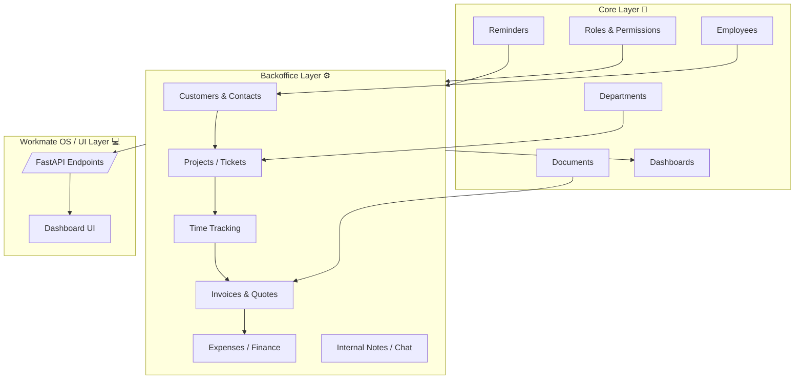
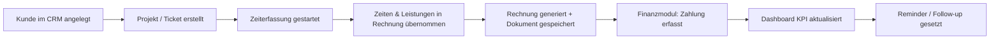

<!-- phase2_backoffice_concept.md -->

# 🧩 WorkmateOS — Phase 2 (Backoffice & CRM) Concept

**Datum:** 24. Oktober 2025  
**Projekt:** WorkmateOS — Phase 2 (Backoffice Layer)  
**Ersteller:** Joshua Phu Kuhrau  
**Firma:** [K.I.T. Solutions](https://kit-it-koblenz.de)

---

## 🎯 Zielsetzung

> Phase 2 erweitert den Core um die operativen Geschäftsprozesse:  
> Kundenverwaltung, Zeiterfassung, Projekte, Rechnungen und interne Kommunikation.  
> 
> Der Fokus liegt auf **API-first-Design**, sauberer Modularität und der Vorbereitung der späteren UI-Schicht (Workmate OS Shell).

---

## ⚙️ Systemübersicht

### **Technische Architektur**

---

## 💡 Funktionaler Ablauf

## 🧱 Modulübersicht

| Modul                     | Zweck                                   | API-Endpunkte (geplant) | Abhängigkeiten                |
| :------------------------ | :-------------------------------------- | :---------------------: | :---------------------------- |
| **CRM**                   | Kunden & Ansprechpartner                |            6            | Core (Employees, Departments) |
| **Projects / Tickets**    | Auftrags- & Vorgangsverwaltung          |            6            | CRM, Employees                |
| **Time Tracking**         | Zeit- und Leistungs­erfassung           |            5            | Employees, Projects           |
| **Invoices / Quotes**     | Rechnungen & Angebote (PDF-Generierung) |            6            | CRM, Time Tracking            |
| **Expenses / Finance**    | Ausgaben, Kategorien, Belege            |            5            | Invoices                      |
| **Internal Chat / Notes** | Kommunikation & Follow-Ups              |            4            | Employees, Projects           |
| **Dashboard (Business)**  | KPI-Layer für Umsatz, Kunden, Zeit      |            4            | Alle oben genannten           |

---

## 🧩 Architektur- und API-Design

**Backend:**

* `app/modules/backoffice/`

  * `crm/`, `time_tracking/`, `invoices/`, `expenses/`, `chat/`
* Einheitliches CRUD-Pattern (nach Core-Vorbild)
* RESTful Design (`/api/backoffice/<modul>`)
* Erweiterte Alembic-Migrations
* Background Tasks für Fälligkeiten (Invoices, Reminders)

**Frontend (zukünftig):**

* Separate Section `/backoffice`
* Tabellen, CRUD-Dialogs, KPI-Cards
* Business-Dashboard mit Filter- und Suchoptionen

---

## 🧠 Technische Erweiterungen

| Bereich       | Änderung                                                               |
| :------------ | :--------------------------------------------------------------------- |
| **Database**  | Neue Tabellen für Finance (invoices, transactions, expense_categories) |
| **Security**  | Zusätzliche Rollen (`finance_admin`, `sales_rep`)                      |
| **Documents** | Wiederverwendung für Rechnungs-PDFs                                    |
| **Reminders** | Automatische Fälligkeitserinnerungen                                   |
| **Metrics**   | Erweiterte Dashboard-KPI (Umsatz, offene Rechnungen, aktive Kunden)    |

---

## 📅 Fahrplan Phase 2

| Schritt                      | Ziel                                 |   Zeitraum  |
| :--------------------------- | :----------------------------------- | :---------: |
| **2.1 – CRM**                | Kunden & Kontakte, Such-/Filterlogik | 24.–27. Okt |
| **2.2 – Time Tracking**      | Start/Stop-System, Sessions          | 28.–31. Okt |
| **2.3 – Invoices**           | PDF-Generierung, Rechnungsworkflow   |  1.–5. Nov  |
| **2.4 – Finance / Expenses** | Belege, Ausgaben                     |  6.–8. Nov  |
| **2.5 – Dashboard Business** | KPI & API-Stats                      |  9.–10. Nov |

---

## 🧭 Architektur-Philosophie

| Ebene          | Aufgabe                                                             |
| :------------- | :------------------------------------------------------------------ |
| **Core**       | Fundament: User, Rollen, Dokumente, Basisdaten                      |
| **Backoffice** | Verwaltung & Prozesse                                               |
| **CRM**        | Beziehungen & Kundendaten (vorerst integriert, später eigenständig) |
| **UI/OS**      | Präsentation, Analytics, Automatisierung                            |

> **Langfristig:** CRM und Finance werden eigenständige Module mit eigenen APIs.
> 
> **Kurzfristig:** Integration in Backoffice zur schnellen Umsetzung und besseren Datenkonsistenz.

---

## ✅ Nächste Schritte

* [ ] Datenbankmodellierung für CRM & Finance
* [ ] API-Blueprints & Schema-Definition
* [ ] CRUD-Logik vorbereiten
* [ ] Unit-Tests & Seeder-Setup
* [ ] API-Doku für Phase 2 anlegen (`/docs/api/backoffice.md`)

---

***powered by K.I.T. Solutions — IT muss nicht schmutzig sein***
