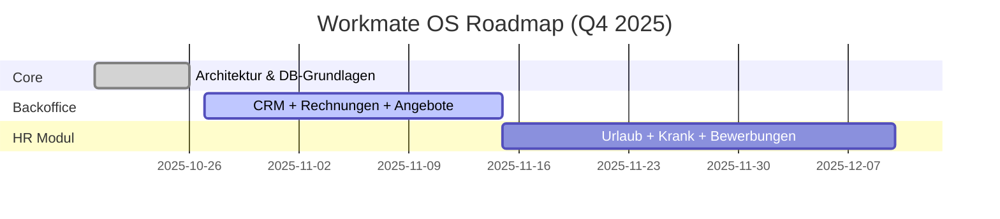
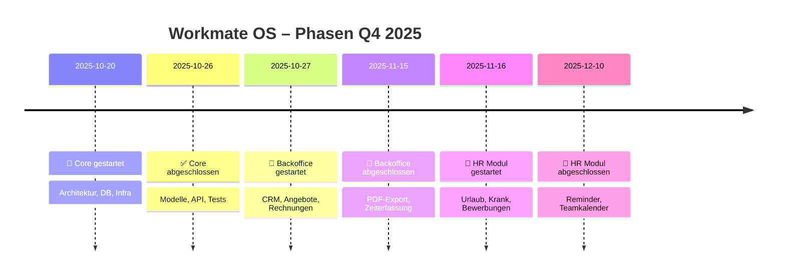

# 🧭 Workmate OS – Wochenstatusbericht  
**Zeitraum:** 21.10.2025 – 28.10.2025  
**Autor:** Joshua Phu Kuhrau (K.I.T. Solutions)  
**Aktualisiert am:** 21.10.2025  

---

## ⚙️ Gesamtüberblick
Workmate OS nähert sich dem Abschluss der Core-Phase.  
Der Fokus liegt diese Woche auf finalen Backend-Anpassungen,  
Alembic-Migrationen und dem Aufbau der ersten UI-Grundstruktur.  
Anschließend startet das **Backoffice-Modul** mit CRM- und Rechnungsfunktionen.

| Phase | Zeitraum | Fortschritt | Status |
|-------|-----------|-------------|--------|
| 🧩 Core | 01.10 – 26.10 | ██████████░░░░░░ 80 % | Im Endspurt |
| 💼 Backoffice | 27.10 – 15.11 | ░░░░░░░░░░░░░░░░ 0 % | Geplant |
| 🧠 HR | 15.11 – 10.12 | ░░░░░░░░░░░░░░░░ 0 % | In Vorbereitung |

---

## 🧩 Phase 1 – Core
**Ziel:** Fundamentale Systembasis (Employee, Department, Documents, Roles, Infra)

### ✅ Erreichte Punkte
- Infrastruktur sauber getrennt (`/srv/infra` / `/workmate_os/infra`)  
- Caddy + TLS + Cloudflare DNS funktionsfähig  
- FastAPI-Struktur mit Modulen und Health-Check aktiv  
- ERM-Modell und Daten-Flows dokumentiert  

### 🔧 Nächste Schritte
- [ ] Core-Modelle finalisieren (Employee, Department, Documents)  
- [ ] Alembic-Migration ausführen + Seed-Daten einspielen  
- [ ] Erste API-Tests via Thunder/Insomnia  
- [ ] UI-Grundlayout aufbauen (DockNav, Dashboard, Login)  

📅 **Geplanter Abschluss:** 26. Oktober 2025  
📍 **Status:** Stabil, letzte Feinarbeiten im Backend  

---

## 💼 Phase 2 – Backoffice
**Ziel:** Interne Geschäftsanwendungen (CRM, Rechnungen, Angebote)

### ✅ Vorbereitungen
- Module & Schema-Planung abgeschlossen  
- ER-Beziehungen zu Core-Entities definiert  

### 🔧 Nächste Schritte
- [ ] Datenmodelle für Customer, Contact, Address  
- [ ] Endpoints für Quotes & Invoices  
- [ ] PDF-/CSV-Export + Line-Item-Logik  
- [ ] Zeiterfassung / Stundenabrechnung  
- [ ] UI-Prototyp (Invoice List, Customer Detail)  

📅 **Geplanter Start:** 27. Oktober 2025  
📅 **Geplanter Abschluss:** 15. November 2025  
📍 **Status:** In Vorbereitung  

---

## 🧠 Phase 3 – HR Modul
**Ziel:** Mitarbeiterverwaltung & Bewerbungsmanagement  

### ✅ Vorbereitungen
- Konzept abgeschlossen (LeaveRequest, SickNote, Applicant)  
- Reminder-System / Redis optional vorgesehen  

### 🔧 Nächste Schritte
- [ ] Datenmodelle & API-Routen implementieren  
- [ ] Teamkalender-Logik entwerfen  
- [ ] UI-Skizze erstellen  

📅 **Geplanter Start:** 15. November 2025  
📅 **Geplanter Abschluss:** 10. Dezember 2025  

---

## 🗺️ Visuelle Roadmap (Mermaid)

---

## 🧩 Entwicklungs-Timeline (kompakt)

---

## 📊 Zusammenfassung

| Kategorie | Bewertung |
|------------|------------|
| **Technik** | 🟢 Stabil |
| **Zeitplan** | 🟢 Im Soll |
| **Fokus** | 💼 Backoffice-Start vorbereiten |
| **Teamstimmung** | 😊 Ausgeglichen & fokussiert |
| **Motivation** | ⚡ Hoch – Struktur steht, Flow kommt |

---

> _Workmate OS wächst von innen nach außen –  
> erst Struktur, dann Nutzen, dann Komfort._  
>
> **„Build tools that work for people, not the other way around.“**  
> — Joshua Phu Kuhrau
