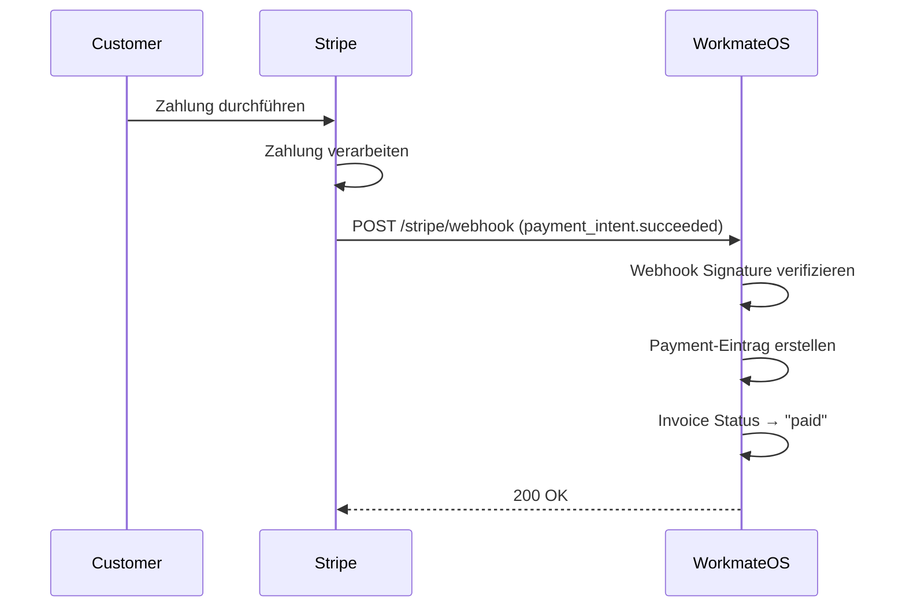

# Stripe Webhook Setup - WorkmateOS

## 🎯 Zweck

Webhooks ermöglichen es Stripe, WorkmateOS automatisch über Zahlungsereignisse zu informieren:
- ✅ **payment_intent.succeeded** → Zahlung erfolgreich → Payment-Eintrag erstellen, Invoice-Status aktualisieren
- ❌ **payment_intent.payment_failed** → Zahlung fehlgeschlagen → Fehler loggen, Admin benachrichtigen

**Ohne Webhooks:** Du musst manuell prüfen, ob eine Zahlung erfolgreich war.
**Mit Webhooks:** Automatische Aktualisierung in Echtzeit!

---

## 🔧 Setup-Anleitung

### **Schritt 1: Webhook in Stripe Dashboard erstellen**

1. **Gehe zu Stripe Dashboard:** https://dashboard.stripe.com
2. **Navigiere zu:** `Developers → Webhooks`
3. **Klicke auf:** `Add endpoint` oder `+ Add an endpoint`

### **Schritt 2: Webhook URL eingeben**

**Production URL:**
```
https://dein-domain.de/api/backoffice/finance/stripe/webhook
```

**Beispiel für WorkmateOS:**
```
https://workmate.kit-it-koblenz.de/api/backoffice/finance/stripe/webhook
```

⚠️ **Wichtig:** Die URL muss **öffentlich erreichbar** sein (HTTPS erforderlich)!

### **Schritt 3: Events auswählen**

Wähle folgende Events aus:
- ✅ `payment_intent.succeeded`
- ✅ `payment_intent.payment_failed`

**Empfehlung:** Wähle nur diese beiden Events, um unnötigen Traffic zu vermeiden.

### **Schritt 4: Webhook Secret kopieren**

Nach dem Erstellen des Webhooks zeigt Stripe das **Signing Secret** an:
```
whsec_...
```

**Wichtig:** Dieses Secret wird nur einmal angezeigt! Kopiere es sofort.

---

## 📝 In WorkmateOS konfigurieren

1. **Gehe zu:** `Finance → Stripe Tab`
2. **Klicke auf:** `Konfigurieren` oder `Bearbeiten`
3. **Fülle aus:**
   - **Publishable Key:** `pk_test_...` (für Test Mode) oder `pk_live_...` (für Live Mode)
   - **Secret Key:** `sk_test_...` (für Test Mode) oder `sk_live_...` (für Live Mode)
   - **Webhook Secret:** `whsec_...` ← Das kopierte Signing Secret
4. **Speichern**

---

## 🧪 Webhook testen

### **Test Mode (Entwicklung)**

Für lokale Entwicklung verwende **Stripe CLI**:

```bash
# Stripe CLI installieren
# https://stripe.com/docs/stripe-cli

# Stripe CLI einloggen
stripe login

# Webhook Events an lokalen Server weiterleiten
stripe listen --forward-to http://localhost:8000/api/backoffice/finance/stripe/webhook
```

Die CLI gibt dir ein **Webhook Secret** aus:
```
Ready! Your webhook signing secret is whsec_...
```

Dieses Secret trägst du in WorkmateOS ein.

**Test-Event auslösen:**
```bash
stripe trigger payment_intent.succeeded
```

### **Production Mode**

1. **Webhook in Stripe Dashboard erstellen** (siehe oben)
2. **URL:** `https://dein-domain.de/api/backoffice/finance/stripe/webhook`
3. **Events:** `payment_intent.succeeded`, `payment_intent.payment_failed`
4. **Secret:** In WorkmateOS eintragen

**Test durchführen:**
1. Erstelle eine Test-Rechnung in WorkmateOS
2. Klicke auf "Mit Stripe bezahlen"
3. Verwende Stripe Test-Kreditkarte: `4242 4242 4242 4242`
4. Zahlung abschließen
5. **Prüfe in WorkmateOS:** Invoice sollte automatisch als "Bezahlt" markiert werden

---

## 🔍 Webhook-Logs prüfen

### **In Stripe Dashboard:**
1. `Developers → Webhooks`
2. Klicke auf deinen Webhook
3. Tab `Logs` → Zeigt alle Events und Responses

### **In WorkmateOS Backend:**
```bash
# Backend Logs anzeigen
docker compose logs backend -f | grep Stripe

# Erfolgreiches Event:
✅ [Stripe] Webhook verified: payment_intent.succeeded
✅ [Stripe] Payment recorded for Invoice RE-2026-0001: €100.00

# Fehlgeschlagenes Event:
⚠️ [Stripe] Payment failed for Invoice 123: Insufficient funds
```

---

## 📋 Webhook Event Flow



---

## 🚨 Troubleshooting

### **Problem: "Webhook verification failed"**

**Ursache:** Falsches Webhook Secret

**Lösung:**
1. Gehe zu Stripe Dashboard → Webhooks
2. Klicke auf deinen Webhook → `Signing secret → Reveal`
3. Kopiere das Secret und trage es in WorkmateOS ein

### **Problem: "Webhook timed out"**

**Ursache:** WorkmateOS Backend nicht erreichbar oder zu langsam

**Lösung:**
1. Prüfe, ob die URL öffentlich erreichbar ist: `curl https://dein-domain.de/api/backoffice/finance/stripe/webhook`
2. Backend-Logs prüfen: `docker compose logs backend -f`
3. Stripe erwartet Response innerhalb von **5 Sekunden**

### **Problem: "Invoice not found"**

**Ursache:** `invoice_id` fehlt in Payment Intent Metadata

**Lösung:**
- Beim Erstellen des Payment Intents wird automatisch `invoice_id` in Metadata gespeichert
- Prüfe Backend-Logs: `📤 [Stripe] Creating Payment Intent for Invoice RE-2026-0001`

---

## 📊 Webhook Best Practices

### **1. Idempotency (Duplikat-Schutz)**

Stripe kann dasselbe Event mehrmals senden. WorkmateOS verhindert Duplikate durch:
```python
# In handle_payment_success()
payment = Payment(
    stripe_payment_intent_id=payment_intent["id"],  # UNIQUE constraint
)
```

### **2. Retry-Mechanismus**

Wenn WorkmateOS nicht antwortet:
- Stripe versucht es **automatisch erneut** (exponential backoff)
- Insgesamt bis zu **3 Tage lang**
- Nach 3 Tagen wird der Webhook als "failed" markiert

### **3. Event-Reihenfolge**

Events kommen **nicht immer in Reihenfolge** an!

**Beispiel:**
```
1. payment_intent.created
2. payment_intent.succeeded  ← Kann VOR created ankommen!
```

WorkmateOS verarbeitet nur `succeeded` und `payment_failed`, daher kein Problem.

### **4. Webhook Sicherheit**

⚠️ **NIEMALS** Webhook ohne Signature-Verifizierung akzeptieren!

WorkmateOS verifiziert automatisch:
```python
event = StripeAPIClient.construct_webhook_event(
    payload,
    stripe_signature,
    webhook_secret  # Aus DB
)
```

---

## 🔐 Produktions-Checkliste

- [ ] Webhook URL ist **HTTPS** (nicht HTTP)
- [ ] Webhook URL ist **öffentlich erreichbar**
- [ ] Webhook Secret in WorkmateOS konfiguriert
- [ ] Events `payment_intent.succeeded` und `payment_intent.payment_failed` aktiviert
- [ ] Test-Zahlung durchgeführt und verifiziert
- [ ] Backend-Logs prüfen auf Fehler
- [ ] Stripe Dashboard Logs prüfen auf erfolgreiche Webhooks
- [ ] Live Mode Keys verwendet (nicht Test Keys)

---

## 📚 Weitere Ressourcen

- **Stripe Webhook Docs:** https://stripe.com/docs/webhooks
- **Stripe CLI:** https://stripe.com/docs/stripe-cli
- **Stripe Test Cards:** https://stripe.com/docs/testing
- **Webhook Best Practices:** https://stripe.com/docs/webhooks/best-practices

---

## 💡 Quick Reference

### **Webhook URL Format:**
```
https://[YOUR_DOMAIN]/api/backoffice/finance/stripe/webhook
```

### **Events to Subscribe:**
- `payment_intent.succeeded`
- `payment_intent.payment_failed`

### **Test Cards:**
```
Success: 4242 4242 4242 4242
Decline: 4000 0000 0000 0002
```

### **Backend Log Commands:**
```bash
# Live Logs
docker compose logs backend -f | grep Stripe

# Letzte 100 Zeilen
docker compose logs backend --tail 100 | grep Stripe
```

---

**Stand:** 2026-01-03
**WorkmateOS Version:** 0.1.0
**Stripe API Version:** 2024-latest
