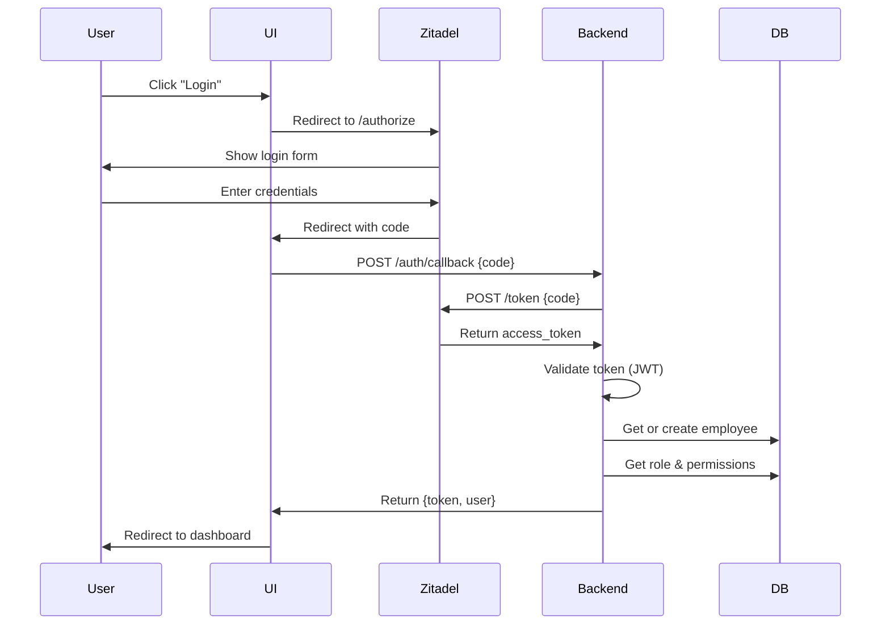

# 🔐 Authentication & SSO - WorkmateOS

**Dokumentations-Status:** ✅ Vollständig
**Letzte Aktualisierung:** 30. Dezember 2025
**Autor:** K.I.T Solutions Team

---

## 📋 Inhaltsverzeichnis

1. [Übersicht](#übersicht)
2. [Zitadel SSO Integration](#zitadel-sso-integration)
3. [OAuth2/OIDC Flow](#oauth2oidc-flow)
4. [Role Mapping System](#role-mapping-system)
5. [Permission System](#permission-system)
6. [Token Validation](#token-validation)
7. [Sequential Employee Codes](#sequential-employee-codes)
8. [Frontend Integration](#frontend-integration)
9. [API Endpoints](#api-endpoints)
10. [Konfiguration](#konfiguration)
11. [Troubleshooting](#troubleshooting)

---

## Übersicht

WorkmateOS verwendet **Zitadel** als zentralen Identity Provider (IdP) mit OAuth2/OIDC Standard-Protokollen. Das System unterstützt:

- ✅ Single Sign-On (SSO)
- ✅ Automatisches Employee Onboarding
- ✅ Role-based Access Control (RBAC)
- ✅ Wildcard Permissions
- ✅ JWT Token Validation
- ✅ Automatische Employee-Code-Generierung

### Warum Zitadel?

- **Open Source** und selbst-hostbar
- **OIDC/OAuth2** Standard-konform
- **Multi-Tenancy** Support
- **Role Management** direkt integriert
- **Audit Logs** für Compliance

---

## Zitadel SSO Integration

### Architektur-Überblick

```
┌─────────────┐         ┌─────────────┐         ┌─────────────┐
│             │         │             │         │             │
│   Browser   │────────▶│   Zitadel   │────────▶│  WorkmateOS │
│   (UI)      │  Login  │   (IdP)     │  Token  │  (Backend)  │
│             │◀────────│             │◀────────│             │
└─────────────┘ Redirect└─────────────┘ Validate└─────────────┘
                                                       │
                                                       ▼
                                                ┌─────────────┐
                                                │  PostgreSQL │
                                                │  (Employee) │
                                                └─────────────┘
```

### Komponenten

| Komponente | Datei | Beschreibung |
|-----------|-------|--------------|
| **SSO Handler** | `backend/app/core/auth/zitadel.py` | OAuth2-Flow, Token-Validierung |
| **Role Mapper** | `backend/app/core/auth/role_mapping.py` | Zitadel-Rollen → Backend-Permissions |
| **Auth Routes** | `backend/app/core/auth/routes.py` | `/auth/callback` Endpoint |
| **Frontend Client** | `ui/src/services/zitadel.ts` | OIDC Client-Integration |
| **Callback Page** | `ui/src/pages/AuthCallbackPage.vue` | OAuth2-Callback-Handler |

---

## OAuth2/OIDC Flow

### 1. Login-Initiierung

**Frontend (`LoginPage.vue`):**
```typescript
import { login } from '@/services/zitadel';

// User klickt auf "Login"
async function handleLogin() {
  await login(); // Redirect zu Zitadel
}
```

**Zitadel Service (`zitadel.ts`):**
```typescript
export async function login() {
  const authUrl = `${ZITADEL_ISSUER}/oauth/v2/authorize?` +
    `client_id=${CLIENT_ID}&` +
    `redirect_uri=${REDIRECT_URI}&` +
    `response_type=code&` +
    `scope=openid profile email urn:zitadel:iam:org:project:id:zitadel:aud`;

  window.location.href = authUrl;
}
```

### 2. Zitadel-Login

User authentifiziert sich bei Zitadel:
- Username/Password
- 2FA (optional)
- SSO-Provider (Google, Microsoft, etc.)

### 3. Authorization Code

Zitadel redirected zurück zu WorkmateOS:
```
https://workmate.kit-it-koblenz.de/auth/callback?code=ABC123...
```

### 4. Token Exchange

**Frontend (`AuthCallbackPage.vue`):**
```vue
<script setup>
const route = useRoute();
const code = route.query.code;

// Send code to backend
const response = await apiClient.post('/auth/callback', { code });
const { access_token, user } = response.data;

// Store token
localStorage.setItem('access_token', access_token);
router.push('/');
</script>
```

**Backend (`routes.py`):**
```python
@router.post("/auth/callback")
async def auth_callback(request: CallbackRequest, db: Session = Depends(get_db)):
    # Exchange code for tokens
    user_info = await zitadel_handler.handle_callback(request.code, db)

    return {
        "access_token": user_info["access_token"],
        "user": user_info["user"]
    }
```

### 5. Token Validation & User Creation

**Zitadel Handler (`zitadel.py`):**
```python
async def handle_callback(self, code: str, db: Session) -> dict:
    # 1. Exchange code for tokens
    tokens = await self._exchange_code_for_token(code)

    # 2. Validate token
    claims = self._validate_token(tokens["access_token"])

    # 3. Get or create employee
    employee = self._get_or_create_employee(db, claims)

    # 4. Map roles to permissions
    permissions = role_mapper.get_permissions_for_user(employee)

    return {
        "access_token": tokens["access_token"],
        "user": {
            "id": employee.id,
            "email": employee.email,
            "role": employee.role.name,
            "permissions": permissions
        }
    }
```

### Sequence Diagram



---

## Role Mapping System

### Zitadel Rollen → Backend Permissions

WorkmateOS mappt Zitadel-Rollen automatisch auf Backend-Permissions.

**Mapping-Logik (`role_mapping.py`):**

```python
class RoleMapper:
    """Maps Zitadel roles to backend permissions"""

    ROLE_PERMISSION_MAP = {
        "Admin": ["*"],  # All permissions
        "CEO": ["*"],    # All permissions
        "Manager": ["backoffice.*"],  # All backoffice modules
        "Employee": [
            "backoffice.time_tracking",
            "backoffice.documents"
        ]
    }

    def get_permissions_for_role(self, role_name: str) -> List[str]:
        """Get permissions for a given role"""
        return self.ROLE_PERMISSION_MAP.get(role_name, [])
```

### Rolle-zu-Permission-Matrix

| Zitadel Rolle | Backend Permissions | Beschreibung |
|--------------|-------------------|--------------|
| **Admin** | `["*"]` | Voller Zugriff auf alles |
| **CEO** | `["*"]` | Voller Zugriff auf alles |
| **Manager** | `["backoffice.*"]` | Zugriff auf alle Backoffice-Module |
| **Employee** | `["backoffice.time_tracking", "backoffice.documents"]` | Basis-Zugriff |

### Datenbankstruktur

**Tabelle: `roles`**
```sql
CREATE TABLE roles (
    id UUID PRIMARY KEY,
    name VARCHAR NOT NULL,
    description TEXT,
    permissions_json JSONB,  -- Array von Permissions
    keycloak_id VARCHAR      -- Zitadel Role ID
);
```

**Beispiel-Daten:**
```json
{
  "id": "uuid-1",
  "name": "Admin",
  "permissions_json": ["*"],
  "keycloak_id": "zitadel-role-admin-123"
}
```

```json
{
  "id": "uuid-2",
  "name": "Manager",
  "permissions_json": ["backoffice.*"],
  "keycloak_id": "zitadel-role-manager-456"
}
```

---

## Permission System

### Wildcard-Unterstützung

WorkmateOS unterstützt **Wildcard-Patterns** für flexible Berechtigungen:

| Pattern | Bedeutung | Beispiele |
|---------|-----------|-----------|
| `*` | Globaler Wildcard | Zugriff auf ALLES |
| `backoffice.*` | Modul-Wildcard | Alle Backoffice-Apps |
| `backoffice.crm` | Spezifisch | Nur CRM-Modul |

### Permission-Check-Logik

**Frontend (`useAuth.ts`):**
```typescript
function hasPermission(permission: string): boolean {
  if (!user.value || !user.value.permissions) return false;

  const userPermissions = user.value.permissions;

  // 1. Check for global wildcard
  if (userPermissions.includes('*')) return true;

  // 2. Check for exact match
  if (userPermissions.includes(permission)) return true;

  // 3. Check for wildcard patterns
  return userPermissions.some(p => {
    if (p.endsWith('.*')) {
      const prefix = p.slice(0, -2); // Remove ".*"
      return permission.startsWith(prefix + '.');
    }
    return false;
  });
}
```

**Beispiele:**

```typescript
// User mit permissions: ["backoffice.*"]

hasPermission("backoffice.crm")        // ✅ true
hasPermission("backoffice.finance")    // ✅ true
hasPermission("backoffice.projects")   // ✅ true
hasPermission("admin")                 // ❌ false

// User mit permissions: ["*"]
hasPermission("anything")              // ✅ true
hasPermission("admin")                 // ✅ true
hasPermission("super.secret.feature")  // ✅ true
```

### Permission-basierte UI-Filterung

**App Registry (`appRegistry.ts`):**
```typescript
export const apps = [
  {
    id: "crm",
    title: "Kunden",
    requiredPermission: "backoffice.crm",
    // ...
  },
  {
    id: "admin",
    title: "Administration",
    requiredPermission: "admin",
    // ...
  }
];
```

**Dock Component (`Dock.vue`):**
```typescript
const dockItems = computed(() => {
  return apps
    .filter(app => {
      if (!app.requiredPermission) return true;
      return hasPermission(app.requiredPermission);
    })
    .map(app => ({ id: app.id, label: app.title, icon: app.icon }));
});
```

**Ergebnis:**
- Admin/CEO sehen **alle Apps** (inkl. Admin-Panel)
- Manager sehen **alle Backoffice-Apps** (ohne Admin)
- Employee sehen nur **spezifische Apps**

---

## Token Validation

### JWT-Struktur

Zitadel gibt JWT-Tokens zurück mit folgender Struktur:

```json
{
  "header": {
    "alg": "RS256",
    "kid": "key-id-123",
    "typ": "JWT"
  },
  "payload": {
    "iss": "https://zitadel.kit-it-koblenz.de",
    "sub": "user-id-123",
    "aud": "workmate-client-id",
    "exp": 1735567200,
    "iat": 1735563600,
    "email": "joshua@kit-it-koblenz.de",
    "name": "Joshua Phu Kuhrau",
    "roles": ["Admin"]
  },
  "signature": "..."
}
```

### Validation-Prozess

**Backend (`zitadel.py`):**
```python
import jwt
from jwt import PyJWKClient

class ZitadelHandler:
    def _validate_token(self, token: str) -> dict:
        """Validate JWT token from Zitadel"""

        # 1. Get JWKS (public keys) from Zitadel
        jwks_client = PyJWKClient(
            f"{self.issuer}/.well-known/openid-configuration/jwks"
        )

        # 2. Get signing key
        signing_key = jwks_client.get_signing_key_from_jwt(token)

        # 3. Decode and validate
        claims = jwt.decode(
            token,
            signing_key.key,
            algorithms=["RS256"],
            audience=self.client_id,
            issuer=self.issuer
        )

        # 4. Check expiration
        if claims["exp"] < time.time():
            raise ValueError("Token expired")

        return claims
```

### Token-Refresh (TODO)

Aktuell nutzen wir **Access Tokens** ohne automatisches Refresh. Für Production sollte implementiert werden:

```python
# TODO: Token Refresh Flow
async def refresh_token(refresh_token: str) -> dict:
    """Refresh access token using refresh token"""
    response = await self.http_client.post(
        f"{self.issuer}/oauth/v2/token",
        data={
            "grant_type": "refresh_token",
            "refresh_token": refresh_token,
            "client_id": self.client_id,
            "client_secret": self.client_secret
        }
    )
    return response.json()
```

---

## Sequential Employee Codes

### Automatische Code-Generierung

Jeder neue Mitarbeiter bekommt automatisch einen **sequentiellen Code** zugewiesen:

**Format:** `PREFIX-NNNN` (z.B. `KIT-0001`, `KIT-0002`, ...)

**Implementierung (`zitadel.py`):**
```python
@staticmethod
def get_next_employee_code(db: Session, prefix: str = "KIT") -> str:
    """Generate next sequential employee code"""

    # 1. Find all existing codes with this prefix
    pattern = f"{prefix}-%"
    employees = db.execute(
        select(Employee.employee_code).where(
            Employee.employee_code.like(pattern)
        )
    ).scalars().all()

    # 2. Extract numbers and find max
    max_number = 0
    code_pattern = re.compile(rf"{prefix}-(\d+)")

    for code in employees:
        match = code_pattern.match(code)
        if match:
            number = int(match.group(1))
            if number > max_number:
                max_number = number

    # 3. Generate next code
    next_number = max_number + 1
    return f"{prefix}-{next_number:04d}"
```

**Beispiel:**

```python
# Vorhandene Codes: KIT-0001, KIT-0002, KIT-0005
get_next_employee_code(db, "KIT")  # Returns: "KIT-0006"

# Keine Codes vorhanden
get_next_employee_code(db, "KIT")  # Returns: "KIT-0001"
```

### Employee-Erstellung

```python
def _get_or_create_employee(self, db: Session, claims: dict) -> Employee:
    """Get existing or create new employee from Zitadel claims"""

    email = claims.get("email")
    employee = db.query(Employee).filter(Employee.email == email).first()

    if not employee:
        # Generate employee code
        code = self.get_next_employee_code(db, prefix="KIT")

        # Get role from Zitadel
        role_name = claims.get("roles", ["Employee"])[0]
        role = db.query(Role).filter(Role.name == role_name).first()

        # Create employee
        employee = Employee(
            employee_code=code,
            email=email,
            first_name=claims.get("given_name", ""),
            last_name=claims.get("family_name", ""),
            role_id=role.id if role else None,
            status="active",
            keycloak_id=claims.get("sub")  # Zitadel User ID
        )

        db.add(employee)
        db.commit()
        db.refresh(employee)

    return employee
```

---

## Frontend Integration

### Login Flow

**1. Login Page (`LoginPage.vue`):**
```vue
<template>
  <div class="login-page">
    <h1>WorkmateOS</h1>
    <button @click="handleLogin" class="login-btn">
      Mit Zitadel anmelden
    </button>
  </div>
</template>

<script setup lang="ts">
import { login } from '@/services/zitadel';

async function handleLogin() {
  await login();
}
</script>
```

**2. Callback Handler (`AuthCallbackPage.vue`):**
```vue
<template>
  <div class="callback-page">
    <p v-if="loading">Authentifizierung läuft...</p>
    <p v-if="error">Fehler: {{ error }}</p>
  </div>
</template>

<script setup lang="ts">
import { ref, onMounted } from 'vue';
import { useRoute, useRouter } from 'vue-router';
import { apiClient } from '@/services/api/client';
import { useAuth } from '@/composables/useAuth';

const route = useRoute();
const router = useRouter();
const { setUser } = useAuth();

const loading = ref(true);
const error = ref('');

onMounted(async () => {
  const code = route.query.code as string;

  if (!code) {
    error.value = 'No authorization code received';
    return;
  }

  try {
    const response = await apiClient.post('/auth/callback', { code });
    const { access_token, user } = response.data;

    // Store token
    localStorage.setItem('access_token', access_token);

    // Set user in auth store
    setUser(user);

    // Redirect to app
    router.push('/');
  } catch (err) {
    error.value = err.message;
  } finally {
    loading.value = false;
  }
});
</script>
```

### Auth Composable

**useAuth.ts:**
```typescript
import { ref, computed } from 'vue';

const user = ref(null);
const isAuthenticated = computed(() => !!user.value);

export function useAuth() {
  function setUser(userData) {
    user.value = userData;
  }

  function hasPermission(permission: string): boolean {
    if (!user.value || !user.value.permissions) return false;

    const userPermissions = user.value.permissions;

    // Global wildcard
    if (userPermissions.includes('*')) return true;

    // Exact match
    if (userPermissions.includes(permission)) return true;

    // Wildcard patterns
    return userPermissions.some(p => {
      if (p.endsWith('.*')) {
        const prefix = p.slice(0, -2);
        return permission.startsWith(prefix + '.');
      }
      return false;
    });
  }

  function logout() {
    localStorage.removeItem('access_token');
    user.value = null;
    window.location.href = '/login';
  }

  return {
    user,
    isAuthenticated,
    setUser,
    hasPermission,
    logout
  };
}
```

---

## API Endpoints

### POST /auth/callback

**Beschreibung:** Exchange authorization code for access token

**Request:**
```json
POST /auth/callback
Content-Type: application/json

{
  "code": "authorization_code_from_zitadel"
}
```

**Response (Success):**
```json
HTTP 200 OK

{
  "access_token": "eyJhbGci...",
  "user": {
    "id": "uuid-123",
    "email": "joshua@kit-it-koblenz.de",
    "first_name": "Joshua",
    "last_name": "Phu Kuhrau",
    "employee_code": "KIT-0001",
    "role": "Admin",
    "permissions": ["*"]
  }
}
```

**Response (Error):**
```json
HTTP 400 Bad Request

{
  "detail": "Invalid authorization code"
}
```

### GET /auth/me (TODO)

**Beschreibung:** Get current user information

```json
GET /auth/me
Authorization: Bearer {access_token}

Response:
{
  "id": "uuid-123",
  "email": "joshua@kit-it-koblenz.de",
  "employee_code": "KIT-0001",
  "role": "Admin",
  "permissions": ["*"]
}
```

---

## Konfiguration

### Backend Environment Variables

**`.env` oder `docker-compose.yml`:**
```bash
# Zitadel Configuration
ZITADEL_ISSUER=https://zitadel.kit-it-koblenz.de
ZITADEL_CLIENT_ID=workmate-production
ZITADEL_CLIENT_SECRET=your-client-secret-here
ZITADEL_REDIRECT_URI=https://workmate.kit-it-koblenz.de/auth/callback

# JWT Configuration
JWT_SECRET_KEY=your-jwt-secret-here
JWT_ALGORITHM=HS256
JWT_EXPIRE_MINUTES=60
```

### Frontend Environment Variables

**`ui/.env.production`:**
```bash
VITE_ZITADEL_ISSUER=https://zitadel.kit-it-koblenz.de
VITE_ZITADEL_CLIENT_ID=workmate-production
VITE_REDIRECT_URI=https://workmate.kit-it-koblenz.de/auth/callback
```

### Zitadel Setup

Siehe: [`docs/ZITADEL_ROLE_SETUP.md`](../../ZITADEL_ROLE_SETUP.md)

**Kurzfassung:**

1. **Application erstellen** in Zitadel
   - Type: Web Application
   - Redirect URI: `https://workmate.kit-it-koblenz.de/auth/callback`
   - Grant Types: Authorization Code
   - Scopes: `openid`, `profile`, `email`

2. **Rollen erstellen:**
   - Admin
   - CEO
   - Manager
   - Employee

3. **Users anlegen** und Rollen zuweisen

4. **Client Credentials** kopieren und in `.env` einfügen

---

## Troubleshooting

### Problem: "Invalid authorization code"

**Ursache:** Code wurde bereits verwendet oder ist abgelaufen

**Lösung:**
- Authorization Codes sind **nur einmal** verwendbar
- Nach Fehler erneut einloggen
- Code hat Ablaufzeit von ~5 Minuten

### Problem: "Token validation failed"

**Ursache:** JWT-Signatur ungültig oder Token abgelaufen

**Lösung:**
```python
# Check token expiration
claims = jwt.decode(token, verify=False)
print(f"Token expires at: {claims['exp']}")
print(f"Current time: {time.time()}")

# Verify JWKS URL is correct
print(f"JWKS URL: {issuer}/.well-known/openid-configuration/jwks")
```

### Problem: "Employee not created"

**Ursache:** Role nicht in Datenbank vorhanden

**Lösung:**
```sql
-- Check if role exists
SELECT * FROM roles WHERE name = 'Admin';

-- Create missing role
INSERT INTO roles (id, name, permissions_json)
VALUES (gen_random_uuid(), 'Admin', '["*"]'::jsonb);
```

### Problem: "Permission denied"

**Ursache:** User hat nicht die erforderliche Permission

**Debugging:**
```typescript
// Frontend Console
const { user } = useAuth();
console.log('User permissions:', user.value.permissions);
console.log('Required permission:', 'backoffice.crm');
console.log('Has permission:', hasPermission('backoffice.crm'));
```

### Problem: "Redirect URI mismatch"

**Ursache:** Redirect URI in Zitadel stimmt nicht überein

**Lösung:**
1. Zitadel Admin UI öffnen
2. Application Settings → Redirect URIs
3. Exakte URI hinzufügen: `https://workmate.kit-it-koblenz.de/auth/callback`
4. **Wichtig:** Keine Trailing Slashes!

---

## 📚 Siehe auch

- [Zitadel Role Setup Guide](../../ZITADEL_ROLE_SETUP.md)
- [Backend Module Übersicht](./MODULE_UEBERSICHT.md) (TODO)
- [API Dokumentation](../../api/API_DOKUMENTATION.md) (TODO)
- [Employee Management](../core/entities.md)

---

## 📝 Changelog

| Datum | Änderung | Autor |
|-------|----------|-------|
| 30.12.2025 | Initiale Dokumentation erstellt | K.I.T Team |
| 30.12.2025 | SSO Flow, Role Mapping, Permissions dokumentiert | K.I.T Team |

---

**🔐 Sicherheitshinweis:** Niemals Client Secrets in Git committen! Immer `.env` in `.gitignore` eintragen.

