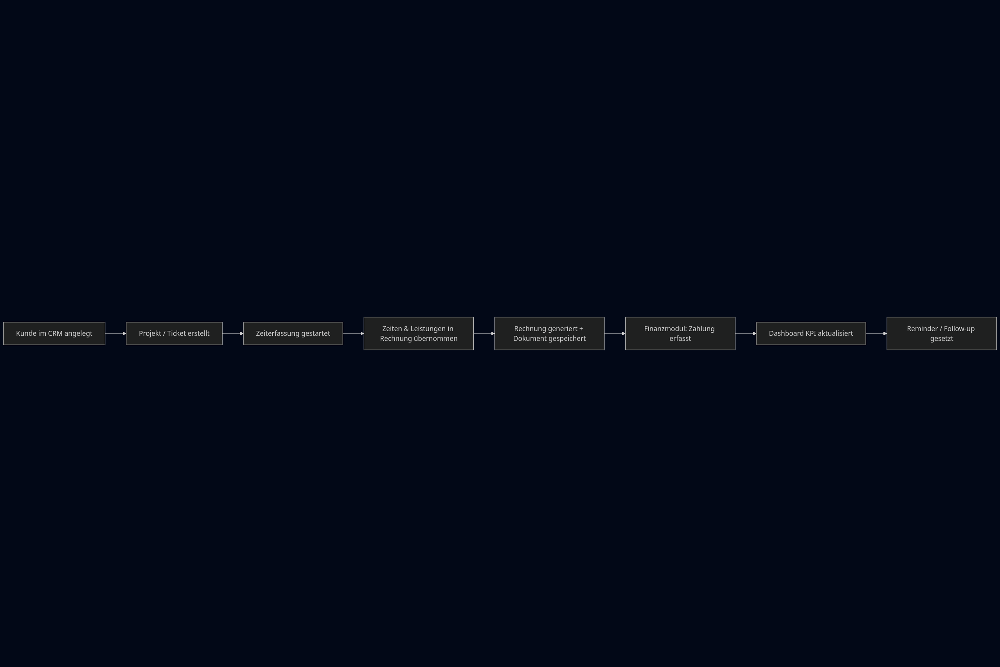

# 🏢 Backoffice & CRM - WorkmateOS

**Phase 2: Backoffice-Layer mit CRM, Projekten, Zeiterfassung und Finanzen**

## Überblick

Das Backoffice-Modul ist der zentrale Bereich von WorkmateOS für die Verwaltung von:
- **Kunden & Kontakten** (CRM)
- **Projekten** & Projektmanagement
- **Zeiterfassung** & Mitarbeitertracking
- **Rechnungen & Zahlungen** (Finance)
- **Ausgaben** & Kostenmanagement
- **Team-Kommunikation** (Chat)

---

## 📚 Dokumentation

| Seite | Beschreibung |
|-------|--------------|
| [Modul-Übersicht](./modul_uebersicht.md) | Alle Backoffice-Module im Detail |
| [Datenbank-Schema](./datenbank_schema.md) | PostgreSQL-Datenbankstruktur für Phase 2 |

---

## 🎯 Kernfunktionen

### 1. CRM (Customer Relationship Management)
- Kundenverwaltung mit Stammdaten
- Kontaktpersonen pro Kunde
- Kundenhistorie & Aktivitäten
- Verkaufsstatistiken

### 2. Projektmanagement
- Projektplanung & -überwachung
- Projektstatus-Tracking
- Kundenzuordnung
- Zeiterfassung pro Projekt

### 3. Zeiterfassung
- Mitarbeiter-Zeitbuchung
- Projektbasierte Zeiterfassung
- Automatische Dauerberechnung
- Notizen & Beschreibungen

### 4. Finanzen
- Rechnungserstellung
- Zahlungsmanagement
- Ausgabenverwaltung
- Finanzberichte

### 5. Team-Kommunikation
- Projektbezogene Chats
- Nachrichtenverlauf
- Team-Benachrichtigungen

---

## 🗄️ Datenbank-Architektur

### Core-Tabellen
```
employees       → Mitarbeiter
departments     → Abteilungen
roles           → Rollen & Berechtigungen
documents       → Dokumentenverwaltung
reminders       → Erinnerungen
dashboards      → Benutzerdashboards
```

### CRM & Backoffice-Tabellen
```
customers       → Kunden
contacts        → Kontaktpersonen
projects        → Projekte
time_entries    → Zeiterfassung
invoices        → Rechnungen
payments        → Zahlungen
expenses        → Ausgaben
chat_messages   → Projekt-Chat
```

---

## 🔗 Modulverknüpfungen

```
Kunde → Kontakte → Projekte → Zeiterfassung → Rechnungen → Zahlungen
  ↓                    ↓            ↓             ↓
CRM Module      Project Mgmt   Time Tracking   Finance
```

---

## 📊 Visuelle Übersicht

### Datenbank-Schema (ERD)


### Modul-Architektur


---

## 🚀 Status

| Modul | Backend | Frontend | Status |
|-------|---------|----------|--------|
| **CRM** | ✅ Vollständig | ✅ Vollständig | 🟢 **Live in Produktion** |
| **Projekte** | ✅ Vollständig | 🔄 In Entwicklung | 🟡 Beta |
| **Zeiterfassung** | ✅ Vollständig | ⏳ Geplant | 🟡 Backend Ready |
| **Rechnungen** | ✅ **Mit PDF-Generator** | ⏳ Geplant | 🟡 Backend Ready |
| **Zahlungen** | ✅ **Auto-Status-Update** | ⏳ Geplant | 🟡 Backend Ready |
| **Ausgaben (Finance)** | ✅ **Mit KPIs** | ⏳ Geplant | 🟡 Backend Ready |
| **Projekt-Chat** | ✅ **Mit WebSocket** | ⏳ Geplant | 🟡 Backend Ready |

### Backend-Features (Implementiert!)

#### ✅ CRM
- CRUD für Kunden & Kontakte
- Statistiken & KPIs
- Aktivitätsverlauf

#### ✅ Projekte
- CRUD für Projekte
- Kundenzuordnung
- Status-Management
- Filter nach Kunde

#### ✅ Zeiterfassung
- CRUD für Zeiteinträge
- Automatische Dauerberechnung
- Mitarbeiter- & Projekt-Filter

#### ✅ Rechnungen (Advanced!)
- **PDF-Generierung** (sync/async mit Background Tasks)
- **Line Items** mit automatischer Positionsnummerierung
- **Zahlungs-Integration** mit Auto-Status-Update
- **Pagination & Filtering** (Status, Kunde, Projekt, Datum)
- **Statistiken** (Umsatz, offene Forderungen, überfällige Rechnungen)
- **Bulk Operations** (Status-Update für mehrere Rechnungen)
- **Recalculate-Endpoint** (Totals neu berechnen)

#### ✅ Zahlungen
- CRUD für Zahlungen
- **Teilzahlungen** unterstützt
- **Auto-Status-Update** (paid/partial)
- Validierung (Betrag nicht höher als outstanding_amount)

#### ✅ Ausgaben (Finance)
- CRUD für Ausgaben
- **KPI-Dashboard** (Gesamt, pro Kategorie, Trends)
- Filter (Kategorie, Projekt, Rechnung, Datumsbereich)
- Pagination

#### ✅ Projekt-Chat
- **WebSocket-basiert** (Echtzeit)
- REST-API für Nachrichtenverlauf
- **Broadcast** an alle verbundenen Clients
- Connection Manager pro Projekt

---

## 🔧 Technologie-Stack

### Backend
- **Framework**: FastAPI (Python)
- **Datenbank**: PostgreSQL
- **ORM**: SQLAlchemy
- **Migrations**: Alembic
- **API**: RESTful JSON

### Frontend
- **Framework**: Vue 3 + TypeScript
- **State**: Pinia
- **UI**: Tailwind CSS + K.I.T Design System
- **Module**: Desktop-ähnliche Fensterverwaltung

---

## 📖 Weitere Ressourcen

- [Backend-Dokumentation](../backend/README.md) - Backend-API & Module
- [Frontend-Dokumentation](../frontend/README.md) - UI-Architektur
- [Core-System](../core/README.md) - Core-Entities & API

---

**Phase**: 2 (Backoffice & CRM Layer)
**Status**: 🔄 In Entwicklung
**Letzte Aktualisierung**: 30. Dezember 2025
