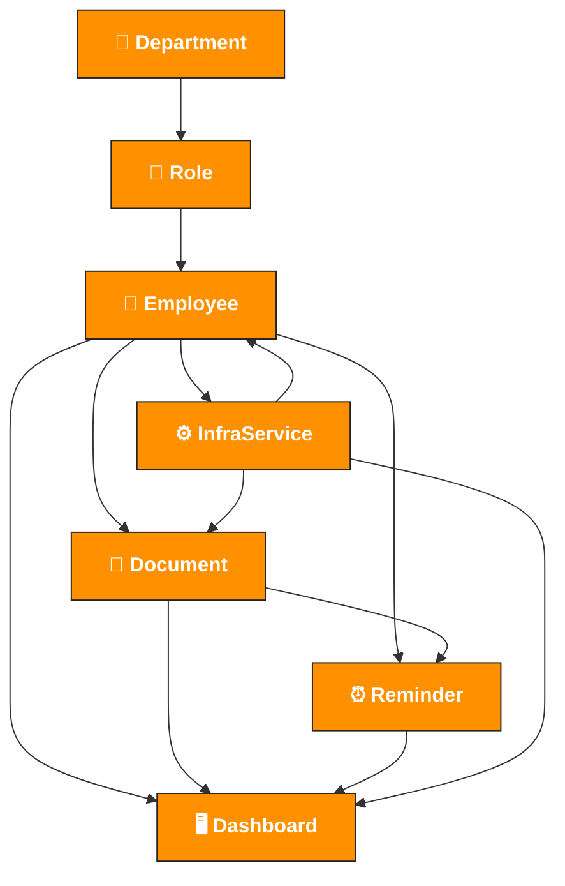

# 🔄 Core Data Flows

Dieses Diagramm zeigt, wie die Core-Komponenten miteinander interagieren.

### 🧠 Beschreibung der Flows
1. **Employee Lifecycle** – Organisation → Rollen → Mitarbeiter  
2. **Document Flow** – Upload, Klassifizierung, Zuordnung  
3. **Reminder Flow** – Zeit- und Ereignisbasierte Benachrichtigungen  
4. **Infra Flow** – Verbindung zu externen Diensten  
5. **Dashboard Flow** – Übersicht für jeden Mitarbeiter
