# 🔄 Core Data Flows

Dieses Diagramm zeigt, wie die Core-Komponenten miteinander interagieren.

```mermaid
flowchart TD
  DEPT["🏢 Department"] --> ROLE["🔐 Role"]
  ROLE --> EMP["👤 Employee"]
  EMP --> DOC["📂 Document"]
  EMP --> REM["⏰ Reminder"]
  EMP --> DASH["🖥 Dashboard"]
  EMP --> INFRA["⚙️ InfraService"]
  DOC --> REM
  DOC --> DASH
  INFRA --> DOC
  REM --> DASH
  INFRA --> DASH
  INFRA --> EMP
  classDef core fill:#ff9100,stroke:#232223,color:#fff,font-weight:bold;
  class DEPT,ROLE,EMP,DOC,REM,DASH,INFRA core;
```

### 🧠 Beschreibung der Flows
1. **Employee Lifecycle** – Organisation → Rollen → Mitarbeiter  
2. **Document Flow** – Upload, Klassifizierung, Zuordnung  
3. **Reminder Flow** – Zeit- und Ereignisbasierte Benachrichtigungen  
4. **Infra Flow** – Verbindung zu externen Diensten  
5. **Dashboard Flow** – Übersicht für jeden Mitarbeiter
