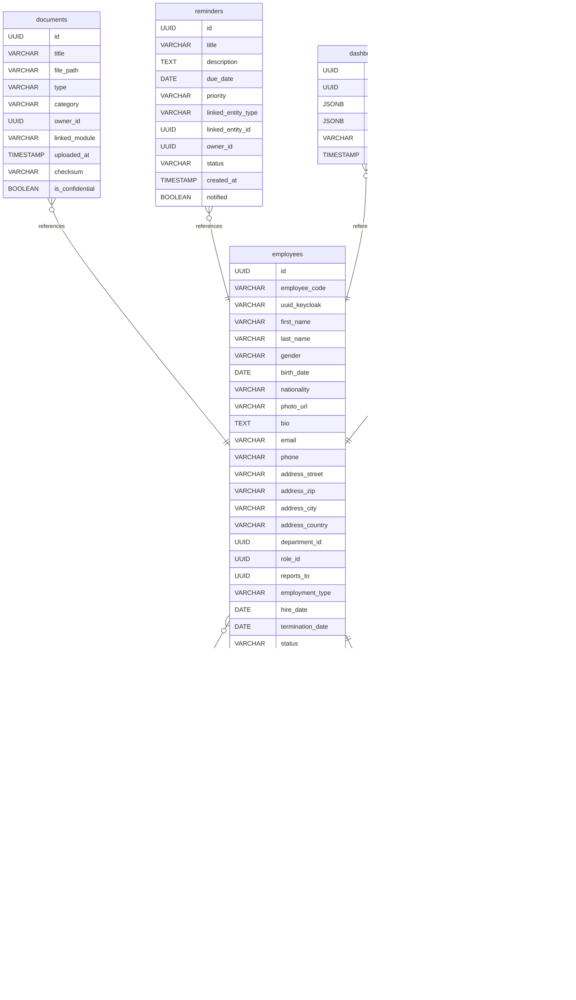

# Untitled Diagram documentation
## Summary

- [Introduction](#introduction)
- [Database Type](#database-type)
- [Table Structure](#table-structure)
	- [employees](#employees)
	- [departments](#departments)
	- [roles](#roles)
	- [documents](#documents)
	- [reminders](#reminders)
	- [dashboards](#dashboards)
	- [infra_services](#infra_services)
- [Relationships](#relationships)
- [Database Diagram](#database-diagram)

## Introduction

## Database type

- **Database system:** PostgreSQL
## Table structure

### employees
Core employee entity with organizational & personal info
| Name        | Type          | Settings                      | References                    | Note                           |
|-------------|---------------|-------------------------------|-------------------------------|--------------------------------|
| **id** | UUID | 🔑 PK, null, unique |  | |
| **employee_code** | VARCHAR | not null |  |KIT-0001 etc. |
| **uuid_keycloak** | VARCHAR | null |  |Linked Keycloak user ID |
| **first_name** | VARCHAR | null |  | |
| **last_name** | VARCHAR | null |  | |
| **gender** | VARCHAR | null |  |male, female, diverse, other |
| **birth_date** | DATE | null |  | |
| **nationality** | VARCHAR | null |  | |
| **photo_url** | VARCHAR | null |  |/uploads/avatars/... |
| **bio** | TEXT | null |  | |
| **email** | VARCHAR | not null |  | |
| **phone** | VARCHAR | null |  | |
| **address_street** | VARCHAR | null |  | |
| **address_zip** | VARCHAR | null |  | |
| **address_city** | VARCHAR | null |  | |
| **address_country** | VARCHAR | null |  | |
| **department_id** | UUID | null | fk_employees_department_id_departments | |
| **role_id** | UUID | null | fk_employees_role_id_roles | |
| **reports_to** | UUID | null | fk_employees_reports_to_employees |Supervisor |
| **employment_type** | VARCHAR | null |  |Default fulltime; values: fulltime, parttime, intern, external |
| **hire_date** | DATE | null |  | |
| **termination_date** | DATE | null |  | |
| **status** | VARCHAR | null |  |Default active; values: active, inactive, on_leave |
| **timezone** | VARCHAR | null |  |Default Europe/Berlin |
| **language** | VARCHAR | null |  |Default de |
| **theme** | VARCHAR | null |  |Default catppuccin-frappe |
| **notifications_enabled** | BOOLEAN | null |  |Default true |
| **matrix_username** | VARCHAR | null |  |@user:intern.phudevelopement.xyz |
| **created_at** | TIMESTAMP | null |  |Default now() |
| **updated_at** | TIMESTAMP | null |  |Default now() |
| **last_login** | TIMESTAMP | null |  | | 

### departments
Organizational unit such as IT, HR, Finance
| Name        | Type          | Settings                      | References                    | Note                           |
|-------------|---------------|-------------------------------|-------------------------------|--------------------------------|
| **id** | UUID | 🔑 PK, null, unique |  | |
| **name** | VARCHAR | not null |  | |
| **code** | VARCHAR | null |  |Short code, e.g. HR, FIN, IT |
| **description** | TEXT | null |  | |
| **manager_id** | UUID | null | fk_departments_manager_id_employees | |
| **created_at** | TIMESTAMP | null |  |Default now() | 

### roles
System roles and access levels
| Name        | Type          | Settings                      | References                    | Note                           |
|-------------|---------------|-------------------------------|-------------------------------|--------------------------------|
| **id** | UUID | 🔑 PK, null, unique |  | |
| **name** | VARCHAR | not null |  | |
| **description** | TEXT | null |  | |
| **keycloak_id** | VARCHAR | null |  |Linked Keycloak role ID |
| **permissions_json** | JSONB | null |  |List of permissions, e.g. ['hr.view', 'finance.edit'] | 

### documents
Central file storage and reference system
| Name        | Type          | Settings                      | References                    | Note                           |
|-------------|---------------|-------------------------------|-------------------------------|--------------------------------|
| **id** | UUID | 🔑 PK, null, unique |  | |
| **title** | VARCHAR | null |  | |
| **file_path** | VARCHAR | not null |  | |
| **type** | VARCHAR | null |  |pdf, image, doc, etc. |
| **category** | VARCHAR | null |  |e.g. Krankmeldung, Vertrag, Rechnung |
| **owner_id** | UUID | null | fk_documents_owner_id_employees | |
| **linked_module** | VARCHAR | null |  |Origin module e.g. HR, Finance |
| **uploaded_at** | TIMESTAMP | null |  |Default now() |
| **checksum** | VARCHAR | null |  | |
| **is_confidential** | BOOLEAN | null |  |Default false | 

### reminders
Universal reminder and notification system
| Name        | Type          | Settings                      | References                    | Note                           |
|-------------|---------------|-------------------------------|-------------------------------|--------------------------------|
| **id** | UUID | 🔑 PK, null, unique |  | |
| **title** | VARCHAR | null |  | |
| **description** | TEXT | null |  | |
| **due_date** | DATE | null |  | |
| **priority** | VARCHAR | null |  |low, medium, high, critical |
| **linked_entity_type** | VARCHAR | null |  |Target type, e.g. Document, Ticket |
| **linked_entity_id** | UUID | null |  | |
| **owner_id** | UUID | null | fk_reminders_owner_id_employees | |
| **status** | VARCHAR | null |  |Default open; values: open, done, overdue |
| **created_at** | TIMESTAMP | null |  |Default now() |
| **notified** | BOOLEAN | null |  |Default false | 

### dashboards
User-specific workspace layout and preferences
| Name        | Type          | Settings                      | References                    | Note                           |
|-------------|---------------|-------------------------------|-------------------------------|--------------------------------|
| **id** | UUID | 🔑 PK, null, unique |  | |
| **owner_id** | UUID | null | fk_dashboards_owner_id_employees | |
| **widgets_json** | JSONB | null |  | |
| **layout_json** | JSONB | null |  | |
| **theme** | VARCHAR | null |  |Default catppuccin-frappe |
| **last_accessed** | TIMESTAMP | null |  | | 

### infra_services
Technical integrations managed by admins (DB, Keycloak, Matrix, etc.)
| Name        | Type          | Settings                      | References                    | Note                           |
|-------------|---------------|-------------------------------|-------------------------------|--------------------------------|
| **id** | UUID | 🔑 PK, null, unique |  | |
| **name** | VARCHAR | not null |  | |
| **type** | VARCHAR | null |  |database, auth, mail, chat, storage, external_api |
| **connection_url** | VARCHAR | null |  | |
| **status** | VARCHAR | null |  |Default active |
| **last_sync** | TIMESTAMP | null |  | |
| **managed_by** | UUID | null | fk_infra_services_managed_by_employees | | 

## Relationships

- **employees to departments**: many_to_one
- **employees to roles**: many_to_one
- **employees to employees**: many_to_one
- **departments to employees**: many_to_one
- **documents to employees**: many_to_one
- **reminders to employees**: many_to_one
- **dashboards to employees**: many_to_one
- **infra_services to employees**: many_to_one

## Database Diagram

